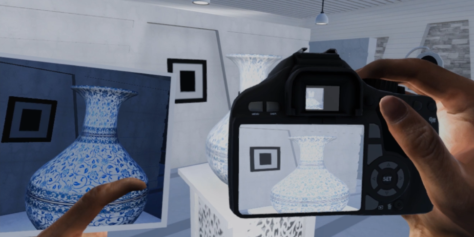

# Appendix: RenderTexture

## 렌더링된 이미지를 가져오고 싶다면?
많은 게임들은 스크린샷 기능을 지원하여 사용자가 현재 실행중인 게임 화면을 이미지 파일로 저장하여 소장할 수 있는 기능을 제공합니다. 이러한 기능들을 구현하기 위해서는 현재 화면에 렌더링된 결과를 데이터 형태로 가져올 필요가 있습니다. 렌더링 된 결과를 잘 사용하  스크린샷과 같은 간단한 활용 뿐만 아니라, 게임속에서 또다른 게임 화면을 렌더링하는 특수한 기능이나 Bloom, Edge Detection 등 게임 화면에 멋진 효과를 연출할 수 있는 Post Processing(후처리 효과)기능을 구현할 때에도 사용할 수 있습니다.



> VR 공간의 모습을 가상의 카메라로 촬영해서 사진으로 소장할 수 있는 재미있는 기능을 구현한 예시

그렇다면 유니티에서는 이러한 기능을 어떻게 구현할 수 있을까요? 유니티 엔진에서는 렌더링 결과 Image를 효율적으로 관리할 수 있는 `RenderTexture` 객체를 통해서 이러한 기능들을 제공합니다. 이번 챕터에서는 RenderTexture를 활용하는 방법을 알아보도록 하겠습니다.


##	RenderTexture
**RenderTexture**는 Camera의 렌더링 수행 결과를 저장할 수 있는 특수한 `Texture` 객체입니다. 렌더링 결과를 받아오고 싶은 Camera에 `RenderTexture`를 적용하면 해당 Camera는 기존처럼 화면에 렌더링 결과를 바로 출력하는 대신, 적용된 `RenderTexture`에 렌더링 결과를 출력합니다.

## 예제 코드 1: 스크린샷 예제
이제부터 RenderTexture 기능을 활용해서 Camera에 Rendering된 결과를 받아오는 기능을 구현해보기로 합시다. 사실, RenderTexture를 활용하는 방법은 그다지 직관적이지 않으며, 조금 까다로운 과정을 거쳐야 합니다.
1. RenderTexture객체를 생성합니다.
2. 렌더링을 수행할 카메라를 선택하고, `camera.targetTexture` 필드에 방금 생성한 `RenderTexture`객체를 설정합니다. 이것은 카메라가 렌더링 결과를 게임 화면이 아니라 우리가 설정해준 `RenderTexture`에 작성한다는 것을 의미합니다.
3. `camera.Render()`함수를 실행하여 카메라가 렌더링을 수행하고, 결과를 RenderTexture에 쓰도록 합니다.

 코드 상으로는 살짝 복잡할 수도 있지만, 일단 같이 첨부한 주석을 보면서 차근차근 그 과정을 살펴보시기 바랍니다.
```cs
void Capture()
{
  Camera camera = Camera.main;

  //텍스처의 사이즈를 현재 Screen 사이즈로 설정.
  var width = Screen.width;
  var height = Screen.height;

  //RenderTexture를 생성
  var renderTexture = new RenderTexture(width, height, (int)camera.depth);

  //Camera가 렌더링 결과를 저장할 RenderTexture를 우리가 생성한 'renderTexture'로 설정.
  camera.targetTexture = renderTexture;

  //Camera Render 수행합니다. 이 과정에서 RenderTexture에 렌더링 결과가 저장됩니다.
  camera.Render();

  //렌더링이 끝나면 카메라의 대상 renderTexture를 비활성화 시킴.
  camera.targetTexture = null;

  //다 사용한 RenderTexture를 삭제.
  Destroy(renderTexture);

}
```
위와 같은 방식으로 RenderTexture에 Camera 렌더링 결과를 저장할 수 있습니다. 하지만, 아직 스크린샷 기능을 구현을 다 완성하지는 못했습니다. 이제 RenderTexture에 쓰여진 렌더링 이미지 픽셀 데이터를 가져와서 출력해야 합니다.


##	RenderTexture의 한계
그렇다면 RenderTexture객체를 사용해서 이미지 데이터를 바로 읽어와서 저장하는 기능을 구현할 수 있을까요? 안타깝게도, RenderTexture 객체는 렌더링 결과를 읽고 쓰는 기능에 특화되어 있기 때문에, Image 데이터를 직접 가공하여 활용하는 작업에는 적합하지 않습니다.

따라서, RenderTexture의 Image 데이터를 더 쉽게 가공하고 활용할 수 있는 다른 형태의 객체로 변환할 필요가 있습니다. 이를 위해서 우리는 유니티의 `Texture2D` 객체를 사용합니다.

## Texture2D
**Texture 2D** 는 유니티 엔진에서 2D 텍스처 데이터를 표현하는 객체입니다. 우리가 프로젝트에 사용하는 2D 이미지/텍스처 리소스들은 주로 이 `Texture2D` 객체로 다뤄지게 됩니다.`Texture2D`는 텍스처를 생성하고 삭제하는 작업, 픽셀 데이터(이미지 데이터)를 읽고 쓰는 작업, 텍스처의 포맷을 설정하는 작업, 인코딩 등 텍스처 데이터를 다룰 때 유용하게 사용할 수 있는 다양한 기능들을 제공합니다.

이제 새로 배운 Texture2D 객체를 사용해서 앞의 미완성 스크린샷 예제를 좀 더 발전시켜 봅시다.

### 예제 코드 2: 스크린샷 예제 추가

우리는 Texture2D 객체를 생성한 뒤에, RenderTexture에서 읽어들인 Image 픽셀 데이터를 Texture2D로 읽어들이는 방식으로 Image 데이터를 가져오려고 합니다. 사실, RenderTexture에서 Pixel데이터를 읽어오는 방식도 그다지 직관적이지는 않지만, 과정을 설명하면 아래와 같습니다.

1. 렌더링 결과가 쓰여진 RenderTexture를 `RenderTexture.Active`에 설정합니다. `Active` 텍스처로 설정된 RenderTexture는 Texture2D 객체에서 픽셀 데이터를 가져올 수 있는 대상이 됨을 의미합니다.
2. Texture2D 객체를 새로 생성하고, `ReadPixels` 함수를 사용해서 픽셀 데이터를 읽어들입니다.

이 작업을 위의 예제 코드에 추가해봅시다.

```cs
void Capture()
{
  Camera camera = Camera.main;

  //텍스처의 사이즈를 현재 Screen 사이즈로 설정.
  var width = Screen.width;
  var height = Screen.height;

  //RenderTexture를 생성
  var renderTexture = new RenderTexture(width, height, (int)camera.depth);

  //Camera의 render 대상 텍스처를 우리가 생성한 'renderTexture'로 설정.
  camera.targetTexture = renderTexture;

  //Camera Render 수행.
  camera.Render();

  //renderTexture를 active renderTexture로 설정해서 Texture2D객체가 Pixel을 읽어올 수 .
  RenderTexture.active = renderTexture;

  //RenderTexture에서 가져올 데이터를 저장할 2D텍스처를 생성.
  var imageTexture = new Texture2D(width, height, TextureFormat.RGB24, false);

  //활성화된 renderTexture에서 2D 텍스처로 픽셀 데이터를 가져옴.
  imageTexture.ReadPixels(new Rect(0, 0, width, height), 0, 0);

  //텍스쳐를 파일 형태로 저장합니다 (다음 예제 코드에서 자세히 설명합니다)
  WriteTexture(imageTexture);

  //카메라의 대상 renderTexture를 비활성화 시킴.
  camera.targetTexture = null;
  RenderTexture.active = null;

  //다 사용한 RenderTexture를 삭제.
  Destroy(renderTexture);

}
```
이번 예제를 통해 RenderTexture에 쓰여진 렌더링 결과 이미지 데이터를 Texture2D 객체로 가져올 수 있었습니다. 이제 스크린샷 기능 구현을 마무리하기 위해 생성한 Texture2D 객체를 저장하는 기능을 추가해 봅시다. 이를 위해서 `WriteTexture`라는 함수를 하나 정의하겠습니다.

### 예제 코드 3: 텍스처 저장하기
Texture2D 데이터를 PNG 이미지 파일로 저장하기 위해서는 먼저 Texture2D에 저장된 픽셀 데이터를 PNG 형식에 맞게 인코딩하는 작업이 필요합니다. 그 다음 파일 이름과 생성할 경로를 정하고, Texture2D 파일을 C#의 `System.IO` 라이브러리를 사용해서 데이터를 Write 하는 작업을 수행합니다. 이 작업을 C# 코드로 나타내면 아래와 같습니다.
```cs
private void WriteTexture(Texture2D texture)
 {
    //Texture데이터를 PNG 데이터 형식으로 Encoding하여 Byte 배열 형태로 변환합니다.
     byte[] pngData = texture.EncodeToPNG();

     //파일 이름과 저장 경로를 설정합니다.
     var now = System.DateTime.Now;

     string fileName = "ScreenShot" + ' ' +".png";

     string folderPath = Application.dataPath + "/" + "ScreenShot";
     string filePath = folderPath+ '/' +fileName;

     //지정한 경로가 없으면, 경로룰 새로 생성합니다.
     if (!Directory.Exists(folderPath))
     {
         Directory.CreateDirectory(folderPath);
     }

     //변환한 이미지 데이터를 지정한 경로에 저장합니다.
     File.WriteAllBytes(filePath, pngData);
 }
```
### 결과
Capture 함수를 호출할 때마다 화면의 이미지가 'ScreenShot'폴더에 PNG 이미지 파일 형태로 저장되는 것을 확인할 수 있습니다.
