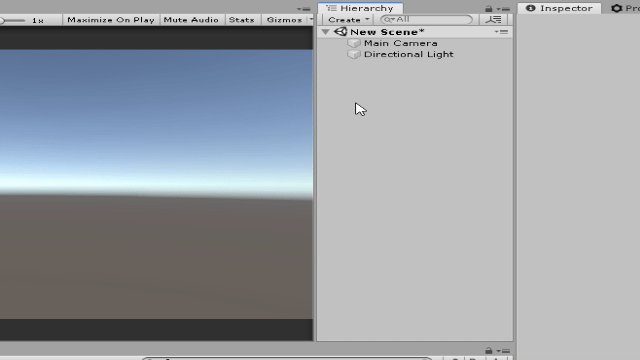

# 1. 유니티  설치하기

## Unity Hub
예전에는 원하는 버전을 다운로드 페이지에서 따로 찾아 설치해야 되는 번거로움이 있었지만,
최근에는 'Unity Hub'라는 설치 관리 프로그램 생겨서 유니티 엔진을 쉽게 설치할 수 있게 되었습니다.

아래 링크에서 유니티 허브를 다운받아 설치하시기 바랍니다.
https://unity3d.com/get-unity/download

### 허브에서 유니티 설치하기
유니티 허브를 실행한 뒤에, 설치 탭을 클릭 한 후, 파란색의 추가 버튼을 클릭합니다.
여기서 자신이 원하는 버전을 선택한 후, 설치하시면 됩니다.

### 허브에서 프로젝트 생성하기
유니티 엔진 설치가 완료되었으면, 프로젝트 탭으로 가서 새 프로젝트를 생성할 수 있습니다.
**새로 생성** 버튼을 누르면 프로젝트 생성을 위한 준비를 할 수 있습니다.

**프로젝트 템플릿** 은 개발 목적에 따라 유니티 엔진을 효과적으로 사용할 수 있도록 생성시에 엔진 설정을 셋업해주는 기능입니다. 2D, 3D 등의 여러가지 옵션이 있어 본인 목적에 맞는 프로젝트 설정을 선택할 수 있습니다.

지금은 가장 기본적인 설정인 '3D' 프리셋을 선택해보도록 하겠습니다.

### 프로젝트 생성 완료!
프로젝트 생성에 성공했다면, 아래처럼 유니티 에디터 화면이 뜨면서 작업을 진행할 수 있게  됩니다.

# 2. Editor 둘러보기
프로젝트를 생성하는 데 성공했으니, 이제 본격적으로 유니티 엔진 에디터가 제공하는 기본 도구들과 작업들을 차근차근 하나씩 살펴봅시다.

## Scene View
Scene 뷰에서는 게임 환경을 제작하기 위한 작업들을 수행할 수 있는 작업용 Viewport 입니다. Scene View는 마우스나 키보드를 조작해서 카메라(뷰)를 움직이면서 환경을 둘러볼 수 있으며, 새로운 오브젝트를 추가하거나 기존의 오브젝트를 배치하고, 움직이는 작업을 수행할 수 있습니다.

## Game View
Game 뷰에서는 실제 게임이 실행되었을 때, 사용자 시점에서 보는 화면이 렌더링 됩니다. Game View의 화면은 Scene에 존재하는 카메라를 기준으로 렌더링 됩니다. 자신이 제작한 게임 환경이 사용자에게 올바르게 보여지고, 잘 작동하는 지 테스트할 수 있습니다.  

**알아두세요!**
> GameView에서는 상단의 탭에서 화면 비율을 조절할 수 있습니다.

## Hierarchy Window
Hierarchy 창에서는 현재 실행중인 Scene에 생성되어 있는 오브젝트들을 관리할 수 있습니다. 이렇게 게임 환경(Scene)에 배치되어 게임에 필요한 작업을 수행하는 객체들을 **GameObject** 라고 부릅니다.

처음 프로젝트를 실행했을 때는 Hierarchy 창에 'Main Camera'와  'Directional Light'라는 두 개의 GameObject가 생성되어 있는 것을 확인할 수 있습니다. 이제 Hierarchy 창을 통해서 임의의 새로운 **Cube** 게임 오브젝트를 추가해봅시다.

#### 게임 오브젝트 생성

1. Hierarchy창에서 오른쪽 마우스 클릭을 해서 생성 메뉴 창을 엽니다.
2. '3D Object'창을 선택하고, 'Cube' 탭을 선택합니다.
3. Scene이나 Gameview에 정육면체 형태의 오브젝트가 생성된 것을 확인할 수 있습니다.

#### 게임 오브젝트 삭제

1. Hierarchy창에서 'Cube' 게임 오브젝트를 선택합니다.
2. 오른쪽 마우스 버튼을 눌러서 메뉴 창을 엽니다.
3. 상단의 'Delete' 탭을 눌러 오브젝트를 삭제됩니다.

## Project Window

Project 창에서는 프로젝트에 사용되는 리소스 파일들을 관리할 수 있습니다. 이러한 리소스 파일들을 '에셋(Asset)'이라고 부르는데, Windows 운영체제에서 파일을 관리하듯이 에셋을 새로 생성하거나, 이동하는 등의 작업을 수행할 수 있습니다.

간단한 예제로 에셋을 하나 생성하고, 이동시키고, 삭제하는 작업을 연습해보겠습니다.

### 에셋 생성 하기

1. Project 창에서 오른쪽 버튼 마우스를 클릭해서 메뉴 창을 엽니다.
2. 'Create' 메뉴창에서 생성할 에셋(예: Material)을 하나 선택해서 생성합니다.

**주의하세요!**

  
> 프로젝트 에셋들은 종류별로 분류해서 체계적으로 관리하는 것이 좋습니다.

### 에셋 이동 하기

1. Project 창에서 이동할 에셋을 선택합니다.
2. 선택한 에셋을 이동시키고싶은 폴더로 드래그해서 옮깁니다.

### 에셋 삭제 하기

1. Project 창에서 이동할 에셋을 선택합니다.
2. 키보드의 Delete 버튼이나 오른쪽 마우스 클릭 후, Delete 탭을 누릅니다.
3. 삭제 경고창이 뜨면 Delete 버튼을 눌러서 삭제를 완료합니다.

**주의하세요!**
> 삭제 경고창에도 나와있듯이, 에셋 파일을 삭제하는 작업은 되돌릴 수 없습니다. 즉, Ctrl + z 등으로 작업을 취소하여 삭제한 피일을 되돌릴 수 없기 때문에 에셋 파일은 항상 신중하게 관리해야 합니다.

## Inspector Window

Inspector 창에서는 현재 선택중인 GameObject에 대한 자세한 정보를 출력합니다. 하나의 게임오브젝트는 각자의 기능을 수행하는 여러개의 객체로 구성되어 있는데, 이러한 GameObject의 자세한 정보를 확인하거나 정보를 수정하고 싶으면, 해당 GameObject를 Scene View나 Hierarchy 창에서 선택하여 Inspector 창에서 작업을 할 수 있습니다.

## Toolbar
### 메뉴 툴

Toolbar 에서는 유니티 엔진이 편리한 게임 제작을 위해 지원하는 다양한 기능들을 확인하실 수 있습니다. 예를 들면, Hierarchy 파트에서 연습했던 새로운 GameObject를 Scene에 추가하는 작업을 Tool 창의 'GameObject' 메뉴를 통해서도 수행할 수 있습니다.

### 조작 툴

아까 위에서 생성했던 Cube를 이 조작 툴을 이용해서 움직여봅시다.

**1. 이동 툴**

이동툴에서 보여지는 화살표를 클릭해서 드래그하면 원하는 방향으로 오브젝트를 움직일 수 있습니다.

**2. 회전 툴**

오브젝트를 회전시키고 싶은 축의 원을 선택하여 드래그하여 원하는 방향으로 오브젝트를 회전시킬 수 있습니다.

**3. 크기 조절 툴**

이동 툴과 비슷하게, 원하는 방향의 화살표를 클랙해서 드래그하여 해당 방향으로 오브젝트의 크기를 조절할 수 있습니다.

## Play/Stop Buttons

Play버튼과 Stop 버튼은 실제 게임 환경을 실행/중지 할 수 있는 버튼입니다. 프로그램에 심각한 오류(Compile Error 등)가 없는 한, 언제든지 Play 버튼을 눌러서 게임을 실행하여 테스트할 수 있습니다.

게임이 실행 중일 때는 GameView가 활성화 되어 플레이어의 View에서 게임을 플레이해볼 수 있습니다. 위의 이미지처럼 입력을 받아서 버튼 기능을 테스트하는 등, 모든 게임 기능이 활성화되기 때문에 자신이 제작한 Scene이 올바르게 작동하는 지 GameView를 통해 테스트 할 수 있습니다.

**주의하세요!**

> _Play 버튼을 눌러서 게임이 실행되는 중에도 Scene, Inspector, Hierarchy등을 통해서 오브젝트를 수동으로 생성, 삭제, 수정 할 수 있지만 이 실행 중에 변경된 사항은 **게임이 끝난 후에 저장되지 않습니다.** 즉, Stop 버튼을 눌러서 **게임이 종료되면 실행 전 상태로 다시 되돌아가며, 실행 중에 변경했던 상태는 반영되지 않습니다**._

> _예외: 엔진 설정이나 에셋 파일 등 몇몇 특수한 요소들은 게임 실행 여부와 관계없이 변경사항이 영구적으로 반영되는 경우도 있습니다._
