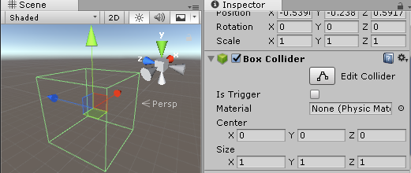
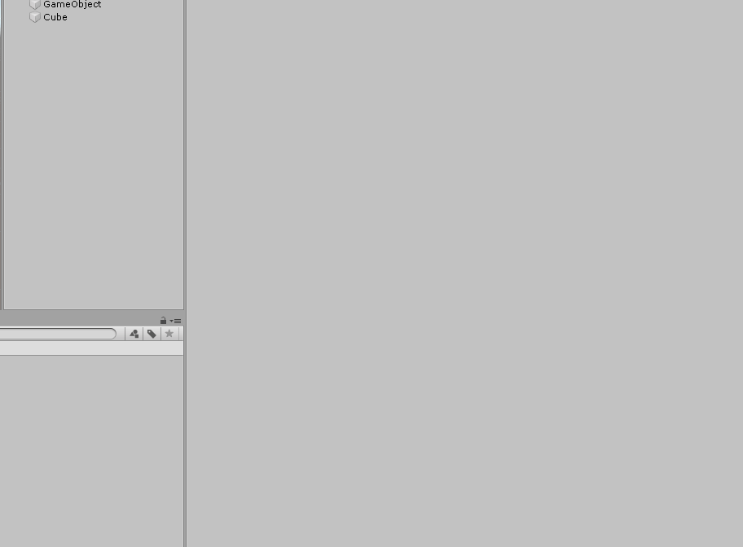

#	GameObject

이전 챕터에서, 유니티 엔진의 Scene을 구성하는 다양한 오브젝트들을 **GameObject** 라고 부른다고 설명드렸습니다. 그리고 유니티 에디터에서 게임 오브젝트를 새로 생성하고 삭제하는 작업도 연습했었습니다. 이번 챕터에서는 유니티 엔진에서 가장 중요한 개념 중 하나인 이 GameObject를 활용하는 방법에 대해 더 상세히 설명드리고자 합니다.

## GameObject란?
GameObject는 유니티 Scene에서 활용할 수 있는 기본 객체를 말합니다. 예를 들면, Cube와 같은 3D 오브젝트나 캐릭터 모델, 빛 효과 및 멋진 이펙트 효과에서 부터 데이터를 관리하는 오브젝트 등 Scene에서 사용되는 모든 것들을 이 GameObject을 통해서 구현할 수 있습니다.  

> 하나의 Game Scene은 Camera, Light, Plane, Cube등 다양한 게임 오브젝트로 구성되어 있습니다

## 게임 오브젝트 다루어보기
이제 게임 오브젝트를 본격적으로 다루어 봅시다. 먼저, 원하는 게임 오브젝트를 Hierarchy나 Scene View에서 원하는 게임오브젝트를 선택한 후, Inspector창에서 작업을 수행할 수 있습니다. Inspector창에서는 GameObject의 이름이나 상태를 변경할 수 있으며, 현재 GameObject가 가진 데이터와 기능들(Component)을 확인할 수 있습니다. Component에 대해서는 다음에 더 자세히 알아볼 예정이므로, 지금은 GameObect를 활용하는 데에만 집중해봅시다.

## 게임 오브젝트 움직이기
게임 오브젝트를 선택한 후, Inspector창을 확인하면 Transform이라는 컴포넌트를 확인할 수 있습니다. Transform은 게임 오브젝트의 위치(Position), 회전(Rotation), 크기(Scale)을 관리하는 컴포넌트로, Transform을 조작해서 게임 오브젝트의 움직임을 조작할 수 있습니다.

>Transform 객체의 Postion, Rotation, Scale을 조절해서 게임 오브젝트를 변형할 수 있습니다.

## Hierarchy 구조
여러 개의 게임 오브젝트를 체계적으로 관리하기 위해, 유니티 엔진은 Hierarchy 구조로 게임 오브젝트를 관리합니다. Hierarchy 구조에서는 하나의 게임 오브젝트가 다른 게임 오브젝트들을 포함할 수 있습니다.

> 'Floor' 오브젝트는 'PaentCube'를, 'ParentCube'는 'ChildCube' 오브젝트를 포함하도록 만들었습니다.

위의 영상처럼 Hierarchy창에서 한 오브젝트를 다른 오브젝트로 드래그해서 포함 관계의 GameObject를 만들 수 있습니다. 이 때, 다른 오브젝트들을 포함하고 있는 상위 오브젝트를 Parent 오브젝트라고 부르며, 한 오브젝트에 포함되어 있는 다른 하위 오브젝트들을 Children 오브젝트 라고 부릅니다.

**Parent와 Children오브젝트의 관계**
Children 게임 오브젝트는 자신의 Parent 게임 오브젝트의 위치, 회전, 크기에 의존합니다. 예를 들어, 달리는 버스 안의 승객들이 버스와 함께 움직이듯이, Parent 오브젝트가 움직이면 Children 오브젝트 또한 같이 따라서 움직이게 됩니다.

>Parent오브젝트를 움직이면, 모든 하위 Child 오브젝트이 같이 움직입니다.

### 활성화/비활성화
상황에 따라서는 현재 사용하지 않는 게임 오브젝트를 완전히 삭제하기 보다는, 임시로 비활성화시켜 두는 방법이 필요할 수 있습니다. 이런 경우를 대비하여, 게임 오브젝트를 활성화/비활성화 하는 기능을 제공합니다. 비활성화된 게임오브젝트는 동작이 정지되지만, 완전히 삭제된 것이 아니기 때문에 데이터는 보존됩니다. 비활성화된 게임 오브젝트는 언제든지 활성화 시켜서 다시 동작을 수행할 수 있도록 변경할 수 있습니다.

>Light 게임 오브젝트를 매번 생성하거나 삭제하지 않고 활성화/비활성화 시켜서 Light를 키고 끌 수 있습니다.

게임 오브젝트르 활성화/비활성화 시키려면 위의 영상처럼 게임 오브젝트 옆에 있는 체크박스를 클릭하면 됩니다. 비활성화된 오브젝트는 Hierarchy에서 회색 텍스트로 표시되기 때문에 활성화/비활성화 여부를 쉽게 파악할 수 있습니다.

**주의하세요!**
게임 오브젝트를 비활성화 하면, 그 게임오브젝트의 모든 하위 오브젝트들 또한 비활성화 됩니다. 따라서, 활성화/비활성화 시킬 GameObect의 Hierarchy 구조에 주의하시기 바랍니다(이는 삭제할 때도 마찬가지 입니다).

>Floor 오브젝트만 비활성화 했지만, Floor의 Child 오브젝트인 Parent Cube와 Child Cube도 같이 비활성화 됩니다. 

## Component 사용하기
사실, GameObject 그 자체만으로는 특별한 기능을 수행하지 못합니다. 대신, GameObject는 특정 기능을 수행할 수 있는 객체인 컴포넌트(Component)를 가질 수 있습니다. 예를 들어, 아래 이미지에서 Inspector 창에 있는 **Box Collider** 가 물리엔진의 충돌판정 기능을 수행하기 위해 게임 오브젝트에 장착되어 있는 Component의 일종입니다.

> BoxCollider 컴포넌트를 가진 GameObject.

### 게임오브젝트에 컴포넌트 추가하기
간단한 예시로, Cube 오브젝트에 RigidBody라는 물리 효과를 부여하는 Component를 추가해서 낙하 효과를 구현해봅시다.

1. Cube 오브젝트를 선택한 후, Inspector창 하단의 AddComponent 버튼을 눌러 메뉴를 엽니다.
2. AddComponent 메뉴에서 'Rigidbody'를 추가합니다.

Rigidbody 컴포넌트 Cube 게임 오브젝트에 생성된 것을 확인했다면, Play 버튼을 눌러서 어떤 일이 일어나는 지 확인해봅시다.

>정지해 있던 Cube가 빠르게 낙하하는 것을 확인할 수 있다.

지금까지 가만히 정지해있던 Cube 오브젝트가 멋지게 낙하하는 것을 확인할 수 있습니다. 이처럼 GameObject에 다양한 기능을 가진 Component를 추가함으로써 게임 오브젝트를 멋지게 디자인 할 수 있습니다.

**주의하세요!**
> 대부분의 컴포넌트는 종류와 무관하게 중복 생성을 허용하지만, 게임 오브젝트 당 단 하나의 컴포넌트만 추가할 수 있는 경우도 있습니다.

### 컴포넌트를 삭제하기
게임 오브젝트에서 컴포넌트를 삭제하는 방법은 간단합니다. 생성한 컴포넌트를 선택하고, 오른쪽 마우스 버튼을 눌러 메뉴를 연 뒤에, Remove Component 탭을 선택하시면 됩니다.

**주의하세요!**
>Transform과 같이 실행에 필수적인 컴포넌트나 서로 의존관계에 있는 텀포넌트들은 삭제가 불가능합니다.
