#	Component
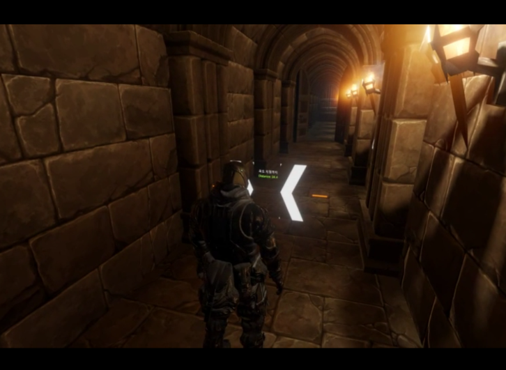

멋진 게임 환경을 구성하기 위해서는 유니티 엔진의 기능을 최대한 잘 활용해야 합니다. 이번 챕터에서는 유니티 엔진의 Component 시스템을 소개하면서 Component를 통해 제공되는 다양한 기능들에 대해 설명드리고자 합니다.

## Component란?

**Component** 는 GameObject가 수행할 수 있는 기능 또는 동작이 정의되어 있는 객체입니다. GameObect 스스로는 아무런 동작을 하지 않기 때문에, 직접 동작을 수행할 수 있는 Component를 추가해야 비로소 게임 객체로서의 역할을 수행할 수 있습니다.

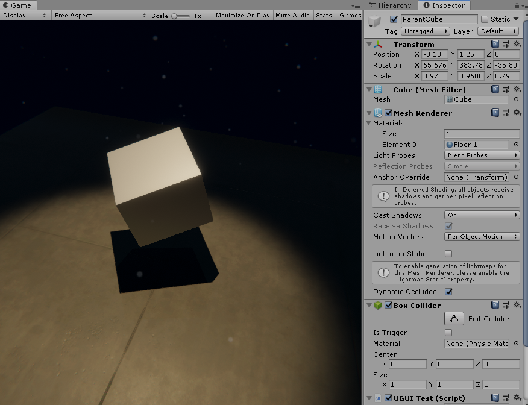

> 회전하는 Cube 게임 오브젝트 하나는 각자의 기능을 수행하는 Component들로 구성되어 있습니다.

이러한 Component의 장점은 한 Component의 기능을 여러 GameObject가 공유할 수 있다는 것입니다. 즉, 기능별로 Component를 적절히 잘 구현해두면, 그 기능을 필요로 하는 모든 GameObect들에 해당 Component를 추가하기만 하면 된다는 것입니다.

## 기본 컴포넌트
유니티 엔진은 다양한 핵심 기능들을 이러한 Component의 형태로 제공하고 있습니다. 따라서, 유니티 엔진을 잘 활용하기 위해서는 자신이 필요로 하는 기능에 대한 Component에 대해 잘 알아둘 필요가 있습니다. 하지만 수많은 기본 컴포넌트들을 일일히 다 소개할 수는 없기 때문에, 가장 많이 쓰이는 Component 위주로 설명드리고자 합니다.

### Transform
Transform은 게임 오브젝트의 위치(Position), 회전(Rotation), 크기(Scale)에 대한 정보를 관리하는 컴포넌트입니다. Transform을 통해서 물체를 이동시키거나, 회전시키거나, 크기를 변경할 수 있습니다.

또한, GameObect의 Hierarchy 구조도 바로 이 Transform이 관리하고 있습니다. 따라서, 어떤 GameObect의 parent나 children 게임 오브젝트에 접근하기 위해서는 바로 이 Transform 객체를 통해야 합니다.

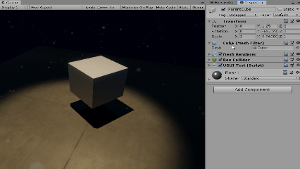

>Transform에 정의된 위치, 회전, 크기 값에 따라 물체의 위치, 회전, 크기도 달라집니다.

**알아두세요**
>모든 GameObect는 반드시 Transform 컴포넌트를 단 1개 가지고 있습니다. 새로운 Transform 컴포넌트를 추가하거나 삭제할 수 없습니다.

### Camera

Camera 는 게임 화면을 렌더링하는 기능을 가진 핵심적인 컴포넌트 중 하나입니다. 에디터의 Game View에서 보이는 장면은 바로 이 Camera 컴포넌트를 통해서 그려지게 됩니다. 따라서, 화면이 게임 캐릭터를 따라 같이 움직이는 기능을 만들고 싶다면 카메라 컴포넌트를 가진 게임 오브젝트를 조작해야 합니다.

또한, Camera 컴포넌트를 통하여 카메라 background 설정, Projection 방식 및 Culling 대상 설정과 Clipping Distance 및 Field of View(FOV)와 같은 뷰 포트 설정을 수행할 수 있습니다.
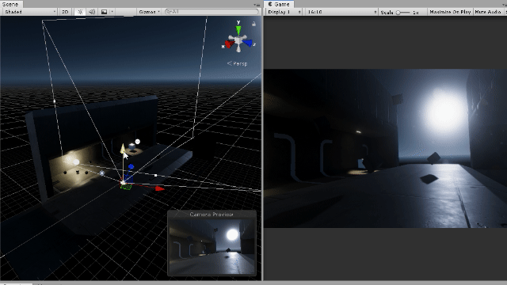

> Game View에 렌더링 되는 화면은 Scene에 존재하는 카메라의 위치와 방향에 따라 움직입니다.

#### Projection 설정

##### Perspective (좌)
현실에서는 멀리 떨어져 있는 물체는 작게 보이고 가까이 있는 물체는 크게 보이는데, Perspective 뷰는 이러한 원근법을 고려합니다. 일반적인 3D 환경에서 가장 많이 사용되는 설정이며, 몇몇 2D 프로젝트에서도 사용할 수 있습니다.

##### Orthographic (우)
반면, Orthographic 뷰에서는 원근법을 고려하지 않기 때문에 카메라로부터의 거리에 따라서 물체의 크기를 다르게 그리지 않습니다. 따라서, 원근법을 고려하지 않아도 되는 2D 프로젝트나 특수한 3D 프로젝트에서 사용됩니다.

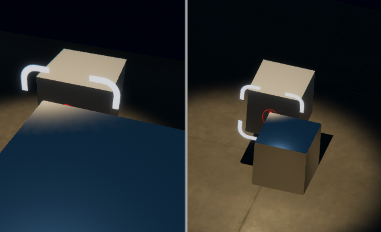

> 똑같은 크기의 큐브로 구성된 같은 환경이라도 뷰에 따라서 완전히 다른 장면으로 보입니다(좌측: Perspective, 우측: Orthographic).

#### Clipping Distance 설정
카메라의 뷰 포트의 최소 거리(Near)와 최대 범위(Far)를 설정할 수 있습니다. 지정된 범위 밖에 있는 오브젝트는 렌더링 되지 않거나 범위에 포함되어 있는 일부 부분만 렌더링 될 수 있습니다.

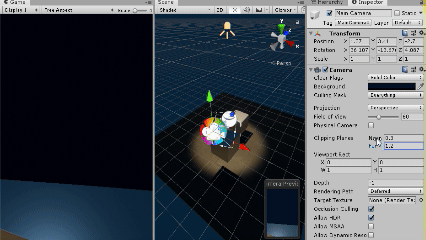

>Clipping Distance의 Near와 Far 값을 줄이자, 화면에 그려지는 Mesh의 범위가 줄어드는 것을 확인할 수 있습니다.

### Light
3D 렌더링 환경에서 광원 효과는 아주 중요한 요소입니다. 유니티 엔진에서는 Light 컴포넌트를 추가하여 광원 효과를 Scene에 추가할 수 있으며 빛의 형태(Light Mode), 밝기, 색, 그림자 효과 등 다양한 세부설정을 제공합니다.

#### 1. Directional Light
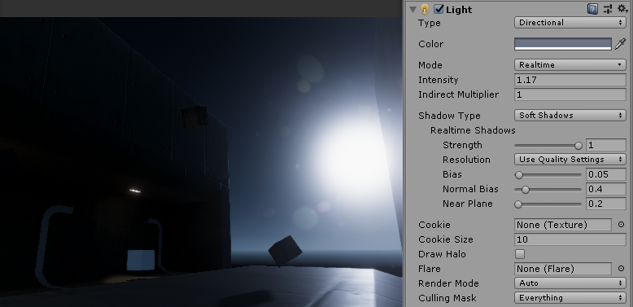

>환경 전체를 비추는 한 방향에서 오는 빛. 야외환경에서는 보통 자연광을 연출하기 위해 사용합니다.

태양과 같이 아주 멀리 떨어져 있어 환경 전체를 비추는 빛을 나타냅니다. Directional Light는 광원이 아주 멀리 떨어져 있어 빛이 한 방향에서만 온다고 가정합니다. Directional Light는 범위에 제한 없이 모든 오브젝트가 광원 효과를 받기 때문에 신중하게 사용해야 하며, 일반적으로는 하나의 Scene에 한 개의 Directional Light면 충분합니다. 사방이 막힌 실내 환경  경우, Directional Light는 필요하지 않을 수도 있습니다.

#### 2. Point Light

> 각각의 Cube의 위치에 따라 그림자의 방향이 다른 것을 알 수 있습니다. 이는 Point Light의 빛 방향은 현재 위치를 중심으로 모든 방향으로 뻗어나가기 때문입니다.

전구의 빛과 같이 한 점에서 시작되어 구 형태의 범위를 가진 빛을 의미합니다. Directional Light와 달리 빛의 방향이 일정하지 않고 모든 방향으로 뻗어나가며, 광원으로 부터 거리가 멀어질 수록 빛이 약해지는 특성을 가지고 있습니다. 이러한 특성 때문에 Point Light 의 방향은 고려하지 않아도 되며, 위치만 신경쓰면 됩니다. 또한, 빛이 최대로 닿을 수 있는 반경을 설정할 수 있습니다.

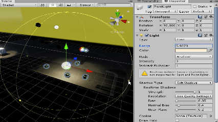

**알아두세요!**
> Point Light의 반경(Range)을 너무 넓게 설정하면 원치 않는 오브젝트에 빛 효과가 적용되어 렌더링 성능에 악영향을 줄 수 있습니다. 적절한 반경을 선택하는 것이 좋습니다.

#### 3. Spot Light

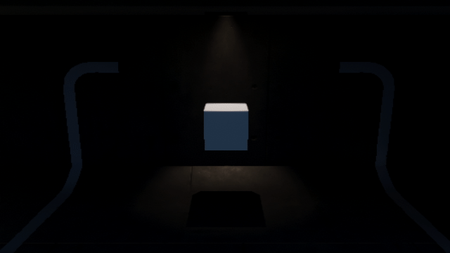

손전등의 빛과 같이 원뿔 형태의 범위를 가진 빛을 의미합니다. Spot Light는 모든 방향으로 빛이 뻗어져 나가는 PointLight와는 달리, 범위(Angle)에 제한이 있습니다. 또한, 빛의 중심에서 가장자리로 갈수록 점점 약해지는 특성을 가지고 있습니다. 이러한 특성 때문에 SpotLight는 광원의 위치와 방향 모두 고려해야 하며, Sport Light의 범위(Angle) 또한 잘 설정해야 합니다.

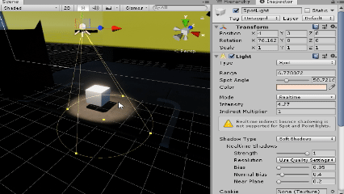

### MeshRenderer

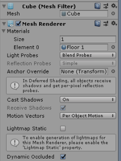

3D Mesh 를 렌더링하기 위해 반드시 필요한 컴포넌트 입니다. 우리가 지금까지 활용한 Cube 오브젝트도 사실 MeshRenderer 컴포넌트에 Cube Mesh와 Material을 적용한 게임 오브젝트입니다.

MeshRenderer 컴포넌트에서는 Mesh의 렌더링 방식을 결정하는 Material, 그림자 사용 여부등을 설정할 수 있습니다.

#### Shader와 Material
**Shader** 는 Mesh를 어떻게 렌더링 할 것인가를 결정하는 프로그램입니다. 게임이나 영화에 나오는 CG 효과처럼 화려하고 복잡한 그래픽 효과들은 일반적인 유니티 프로그래밍으로 구현하기 어려우며, 대부분 Shader 프로그래밍을 통해서 구현해야 합니다.

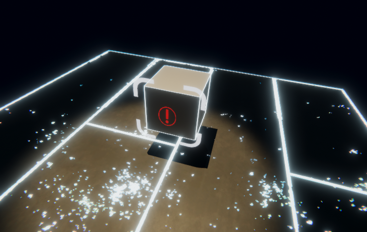

> 몇몇 특수한 효과는 Shader 프로그래밍으로 직접 렌더링 방식을 구현해야 합니다.

**Material** 은 Shader에서 정해놓은 세부 설정들을 조정하여 렌더링 작업에 적용할 수 있게 만든 객체입니다. 즉, Shader 프로그래밍이 실체화 된 객체라고 볼 수 있습니다. 하나의 Shader를 바탕으로 다양한 Material을 생성하여, 목적에 맞는 Material을 적용할 수 있습니다.

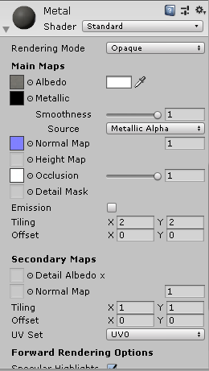

> Shader 프로그램에서 정해놓은 다양한 설정 정보들을 Material마다 개별적으로 설정할 수 있다.

Shader 프로그래밍은 일반적인 유니티 프로그래밍에서 벗어나는 내용이기 때문에 자세히 다루지 않겠습니다. 하지만, 이미 유니티에서 충분히 좋은 성능의 Standard Shader를 제공하기 때문에 일반적인 환경을 만드는 데에는 문제가 없을 것입니다.

#### 참고: Mesh Filter 컴포넌트
MeshRenderer가 렌더링할 Mesh 리소스 데이터를 가지고 있는 컴포넌트입니다. 딱히 특별한 기능은 없지만, 이 컴포넌트가 없으면 MeshRenderer가 제대로 작동하지 않습니다.

### SpriteRenderer
2D 텍스처를 렌더링하기 위한 Renderer 컴포넌트 입니다. PNG와 같은 이미지 파일을 유니티 엔진에서 활용하고 싶을 때 사용할 수 있습니다. SpriteRenderer는 2D 컨텐츠를 제작할 때 주로 사용되지만, 3D 환경에서도 평면적인 물체를 렌더링 할 필요가 있을 때 사용할 수 있습니다.

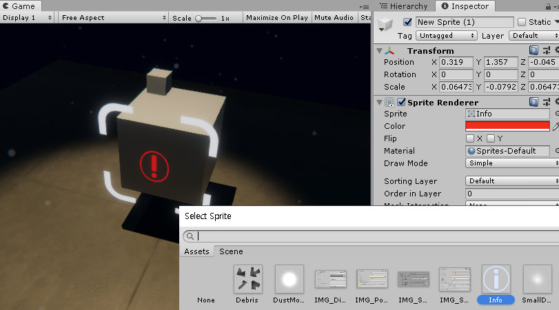
> 원하는 이미지를 이미지 선택창에서 설정하고, 원한다면 색상도 변경할 수 있습니다

Sprite 컴포넌트를 통해 우리가 원하는 이미지(텍스처)를 선택할 수 있으며, 필요에 따라서 이미지의 Tint 색을 입히거나 뒤집는 것도 가능합니다. 또한, Sprite간 겹치는 순서를 정할 수도 있습니다.

## UI 관련
메뉴 화면의 시작 버튼과 같은 User Interface 관련 기능은 3D 환경이 아니라 2D 모니터 화면과 상호작용해야 하기 때문에 일반적인 게임 객체와는 조금 다른 방식으로 다룰 필요가 있습니다. 유니티 엔진에서는 이러한 UI 오브젝트들을 쉽게 다룰 수 있도록 다양한 UI Component기능들을 제공합니다.
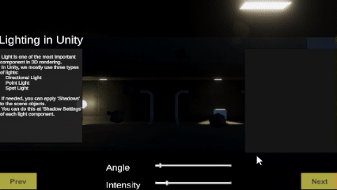

>게임 화면 위에 텍스트, 버튼, 슬라이더 등 상호작용 가능한 UI 오브젝트를 그릴 수 있다.

### Canvas
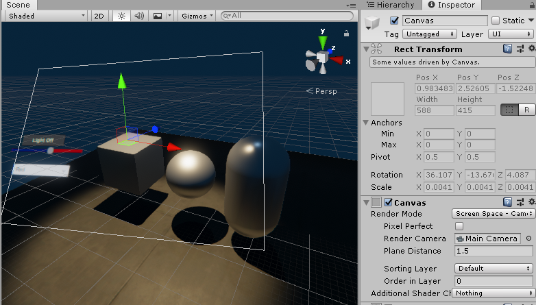

UI 오브젝트를 효과적으로 배치할 수 있는 기능을 제공하는 컴포넌트 입니다. UI 오브젝트는 일반적인 GameObject의 Transform과는 달리, 3D World 좌표계를 사용하는 것 보다는 게임 화면에서의 위치, 즉 Pixel Coordinate를 기준으로 위치를 선정하는 것이 편리합니다. 이러한 특수한 좌표 시스템을 유니티 엔진에서는 RectTransform 이라고 부릅니다. Canvas 컴포넌트는 이러한 RectTransform을 기반으로 UI Object들을 화면에 알맞게 배치할 수 있는 기능을 제공합니다.

**알아두세요**
>앞서 모든 GameObect는 반드시 Transform 컴포넌트를 단 1개 가지고 있다고 말씀드렸지만, UI 컴포넌트는 Transform 대신 RectTransform을 가지고 있습니다. 사실, RectTransform은 Transform의 한 종류입니다.

### 그 외 컴포넌트들...
Canvas에는 텍스트, 이미지, 버튼 등 다양한 기능을 가진 UI 컴포넌트를 추가할 수 있습니다. 이들 컴포넌트에 대한 자세한 활용방법은 유니티 기초 프로그래밍을 학습한 이후인 **UI** 챕터에서 더 자세히 다루도록 하겠습니다.

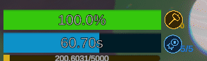

> 영상과 같이 우리가 제작한 컨텐츠가 UI 시스템과 실시간으로 상호작용하며 동작하게 만들기 위해서는 기초적인 유니티 프로그래밍 지식이 필요합니다.

## 물리 효과 관련
게임 오브젝트에 멋진 물리 효과를 연출하기 위해서는, 두 가지 컴포넌트가 필요합니다. 하나는 물체의 물리적 성질을 정의하는 **Rigidbody** 컴포넌트이며, 다른 하나는 물리적 형태를 정의하는 Collider 컴포넌트입니다. 이 두 가지 컴포넌트를 활용하는 방법에 대해서는 **Physics** 파트에서 자세히 다룰 예정이지만, 대략 어떤 일을 하는 컴포넌트인지 간략하게 알아봅시다.

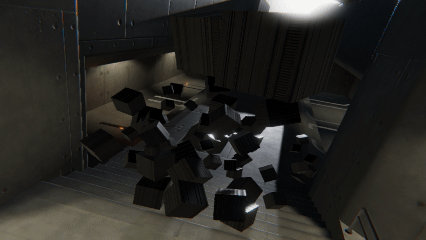

> Rigidbody와 Collider 컴포넌트를 적용한 수많은 Cube 오브젝트들이 가지고 서로 충돌하면서 계단 위로 떨어지는 장면입니다.

### Rigidbody
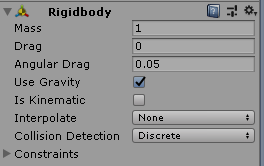

게임 오브젝트에 질량, 중력 등 물리적인 성질을 부여해서 물리 효과를 사용할 수 있도록 합니다. Mass, Drag, gravity 등을 설정하여 섬세하게 물리효과를 조절할 수 있습니다.

### Collider
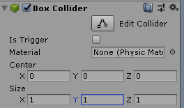
Rigidbody만 적용해서는 충돌효과를 만들 수 없습니다. 두 물체가 어떻게 생겼는지 알 수 없다면, 서로 충돌했는지 알 도리가 없기 때문입니다. 따라서, 유니티 엔진에서 충돌 효과를 만들기 위해서는 물체의 물리적 형태를 정의한 Collider 컴포넌트를 추가해야합니다.

Collider는 형태에 따라서 Sphere, Capsule, Box 3종류가 있으며, 별개로 Mesh Collider라는 특수한 Collider도 존재합니다. 자세한 내용은 Physics 챕터에서 다루도록 하겠습니다.

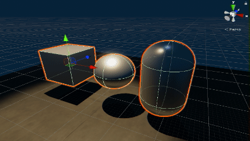

>왼쪽에서 부터 Box, Sphere, Capsule 콜라이더. Scene View에서는 초록색 outline으로 표시됩니다.

**주의하세요**
>화면에 그려지는 Mesh의 형태와 실제 Collider의 형태는 다를 수 있습니다. 물론, 같은 경우도 있긴 하지만(Mesh Collider 등) 항상 그런 것은 아닙니다.

## 사운드 관련
### AudioSource
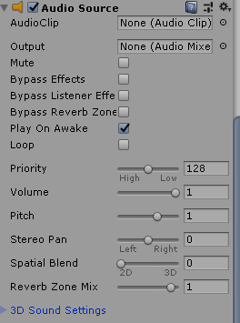
AudioSource는 소리를 재생할 수 있는 오디오 컴포넌트입니다. WAV, MP3 등 엔진에서 사용되는 다양한 사운드 리소스를 유니티 엔진에서는 AudioClip이라고 부르는데, 이러한 AudioClip을 AudioSource 컴포넌트에 전달하여 사운드를 재생할 수 있습니다. 단순히 사운드를 재생하는 것 외에도 반복 재생 기능, 볼륨, 높낮이 등을 설정할 수 있으며 3D 환경에서 사운드의 위치와 듣는 사람과의 거리를 고려하여 몰입감을 높일 수 있는 3D Sound 기능 또한 제공합니다.

## 마무리
이번 챕터에서는 유니티 엔진에서 제공하는 다양한 Component에 대해 소개해드렸습니다. 사실, 이렇게 짧은 소개만으로는 각각의 Component의 기능을 완전히 이해하는 것은 어려우셨을 것이라 생각됩니다. 하지만, 다음 챕터부터는 이들 Component를 활용하는 방법에 대해서 훨씬 더 자세히 알려드릴 것이기 때문에, 이번 챕터에서는 일단 '이런게 있구나' 정도만 알아두시면 되겠습니다.
