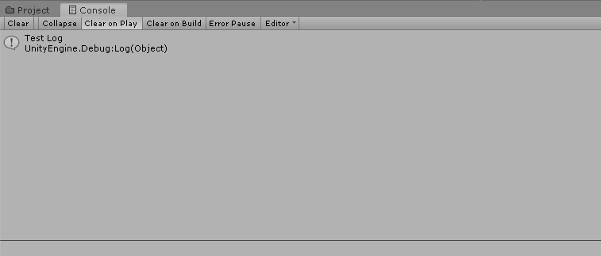

# 유니티 기초 스크립팅

지난 챕터에서는 유니티에서 제공하는 기본 컴포넌트에 대해서 배웠습니다. 이번 챕터에서는


## 커스텀 컴포넌트 및 스크립트 파일 생성하기

유니티에서 제공하지 않는 기능을 구현하기 위해 우리가 직접 컴포넌트를 만들 수 있습니다. 새로운 컴포넌트를 만들기 위해서는 아래와 같은 작업을 통해 Script 파일을 만들어야 합니다.

1. 새로운 Component를 추가할 게임 오브젝트를 선택한 후, Inspector창 하단의 AddComponent 버튼을 눌러 메뉴를 엽니다.
2. AddComponent 메뉴에서 New Script 탭을 선택하고, 새로 생성할 Script의 이름을 작성하여 생성을 완료합니다.


생성에 성공하셨다면 게임 오브젝트에 'TestScript'라는 컴포넌트가 새로 추가된 것을 확인할 수 있습니다. 또, Project Window에 새로운 C# 스크립트 파일(확장자 명 'cs')이 생성되었을 것입니다.


> Project 창에 'TestScript'라는 스크립트 파일이 생성된 것을 확인할 수 있습니다.

__생성이 잘 되지 않았나요?__
> * 이미 동일한 이름의 Component가 존재하거나 생성 불가능한 이름을 입력하지 않았는지 확인해보세요.
> * 다른 스크립트에 오류가 있어서 유니티 엔진이 컴파일에 실패했을 경우, 스크립트가 제대로 추가되지 않은 것 처럼 보일 수 있습니다. 해당 오류를 해결하고 컴파일에 성공한 뒤에 다시 확인해보세요.


## Console 창에 Log 메시지 출력하기
우리가 작성한 코드가 올바르게 작동하는지 확인하기 위해서는 디버깅 작업이 필요합니다. 흔히 많이 사용하는 디버깅 작업은 특정한 메시지를 출력해서 코드의 실행 상태 및 결과를 확인하는 `Logging` 방식인데, 이렇게 출력된 로그 기록들을 유니티에서는 Console창에서 확인할 수 있습니다



>프로그램에서 출력된 Log 메시지들은 Console창에서 확인할 수 있습니다.


### Log 메시지 출력하기
그렇다면 우리가 프로그램에서 Unity 콘솔 창에 메시지를 출력하는 방법을 알아보겠습니다. 유니티 엔진은 Debug라는 클래스를 통해서 Log 메시지를 출력하는 몇가지 함수들을 용도에 맞게 제공하고 있습니다.

1. `Debug.Log`
일반적인 상황에서의 Log 메시지를 출력합니다.

2. `Debug.LogWarning`
오류는 아니지만 주의가 필요한 내용을 표시하기 위해 사용되며, 노란색 경고로 표시됩니다.

3. `Debug.LogError`
에러 상황을 표시하기 위해 사용되며, 빨간색 글자로 표시됩니다.

#### 예제 코드
Log, LogWarning, LogError가 콘솔창에 어떻게 출력되는지 한 번 직접 확인해보겠습니다. Deubg 클래스의 Log 함수들을 사용해서 원하는 문구를 출력해봅시다.

```cs
public class LogTest : MonoBehaviour
{
    // Start is called before the first frame update
    void Start()
    {
        Debug.Log("Hello, Log!");
        Debug.LogWarning("Hello, LogWarning!");
        Debug.LogError("Hello, LogError!");
    }
}
```

#### 실행 결과


**주의하세요**
> 우리가 직접 입력한 디버깅 로그 뿐만 아니라 프로그램 수행 중에 발견될 수 있는 **심각한 에러 상황** 들은 보통 붉은 색 로그로 표시되기 때문에, Console 창에 붉은색 로그가 발견되었다면 **그냥 지나치지 말고 주의깊게 살펴보시기 바랍니다.**


##컴포넌트 참조하기
우리가 생성한 스크립트에서 Rigidbody 같은 다른 컴포넌트를 활용하고 싶다면 어떻게 해야할까요? 지금 부터는 스크립트에서 다른 컴포넌트를 참조하는 방법을 알아보겠습니다.

### Reference 변수 선언하기
우리가 스크립트에서 다른 Component를 사용하기 위해서는 해당 Component를 참조할 수 있는 변수를 선언해야 합니다. 이러한 변수를 Reference변수라고 하는데, C/C++언어의 포인터 변수와 비슷한 개념입니다. C#에서는 포인터 개념이 없는 대신, 다른 객체를 참조할 수 있는 Reference 변수를 통해서 비슷한 기능을 제공합니다.

#### 예제 코드
`Rigidbody` 컴포넌트를 `rigidbody`라는 레퍼런스 변수로 선언해봅시다.
```cs
public class TestScript : MonoBehaviour
{
    //Class안에 Rigidbody 컴포넌트를 선언하였습니다.
    public Rigidbody rigidbody;

}


```

#### 에러 발생!
하지만, 선언만으로는 `rigidbody`를 바로 사용할 수 없습니다. `rigidbody`는 말그대로 다른 Rigidbody객체를 참조하는 변수이기 때문에, rigidbody가 참조할 객체를 설정해줄 필요가 있기 때문입니다. `rigidbody`에 다른 객체를 설정해 주지 않고 사용을 시도하면 오류가 발생합니다. rigidbody가 아무것도 참조하고 있지 않기 때문에 주어진 동작을 수행할 수 없기 때문입니다.


```cs
public Rigidbody rigidbody; // Rigidbody가 아무것도 참조하고 있지 않습니다.

// Start is called before the first frame update
void Start()
{
    rigidbody.useGravity = false; // 오류 발생!(Null Reference Error)
}
```


> Reference를 제대로 설정해주지 않고 rigidbody를 사용하려고 하면 오류가 발생합니다.


다른 컴포넌트의 참조를 우리가 선언한 `rigidbody` 변수에 할당하는 방법은 크게 2가지가 있습니다.

### 방법 1. 에디터를 통해 참조하기
가장 간단한 방법은 Inspector 창에서 Drag & Drop 방식으로 할당하는 방법입니다. 원하는 컴포넌트를 클릭하고, 지정된 Reference 변수로 드래그해서 가져갑니다. 이제, 우리가 선언한 `rigidbody` 변수는 우리가 드래그해서 가져간 `Rigidbody`컴포넌트를 참조하게 됩니다.


__알아두세요__
> 혹시 우리가 TestScript 파일에 선언한 `rigidbody` 변수가 Inspector창에 드러나지 않으면, 변수를 `public`으로 선언하였는지 확인해보세요. Class에 선언한 변수가 Inspector창에 드러나려면 변수가 public으로 선언해야 합니다.

```cs
//Inspector 창에 뜬다
public Rigidbody rigidbody;

//Inspector 창에 뜨지 않는다.
Rigidbody rigidbody;
```


### 방법 2. 스크립트에서 참조하기
에디터에서 직접 참조하는 것보다 스크립트에서 참조하는 것이 더 편리한 상황이 있습니다. 이런 경우에는 스크립트에서 Component의 참조를 바로 가져올수 있는 `GetComponent` 함수를 사용합니다. `GetComponent` 함수는 현재 게임오브젝트가 가지고 있는 특정 컴포넌트의 참조를 찾아 반환하는 함수입니다.

사용하는 방법은 간단합니다. `GetComponent<>`함수의 꺽쇠 안에 우리가 찾고자 하는 Component의 타입(클래스 이름)만 입력해주면 해당 게임오브젝트가 주어진 타입의 컴포넌트를 가지고 있는지 확인하고, 만약 있다면 해당 객체의 참조를 반환합니다. 예를 들어, `Rigidbody` 컴포넌트를 참조를 가져오고 싶다면 아래와 같이 코드를 작성할 수 있습니다.
```cs
rigidbody = GetComponent<Rigidbody>();
```
> `Rigidbody` 컴포넌트의 참조를 찾아 `rigidbody` 레퍼런스 변수에 할당합니다.


**참고하세요!**
> Transform도 컴포넌트의 일종이지만, 굳이 `GetComponent<Transform>()`를 사용해서 가져올 필요는 없습니다. Transform은 `transform`프로퍼티를 통해 바로 사용할 수 있습니다.

```cs
Debug.Log(transform.position);
```
> GetComponent를 사용하지 않고 transform을 통해서 바로 접근할 수 있습니다.
