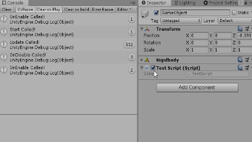

#	유니티 C# 스크립팅 기초
## 유니티 이벤트 함수

우리가 작성한 스크립트를 엔진과 함께 잘 작동하도록 하는 것은 쉬운 일이 아닙니다. 스크립트를 유니티 엔진의 산더미 같은 소스코드 중간에 끼워넣을 수도 없는 노릇입니다.

이러한 상황을 해결하기 위해 유니티 엔진에서는 **이벤트** 함수라는 것이 존재합니다.

이벤트 함수는 우리가 작성한 코드가 유니티 엔진의 게임 루프에 맞추어 실행될 수 있도록 유니티 엔진에서 정의한 함수입니다. 유니티 엔진이 알아서 이 함수들을 감지해서 정해진 타이밍에 해당 함수를 실행하기 때문에, 이들 이벤트 함수들을 몇가지 익혀두기만 하면 우리가 작성한 코드가 유니티 엔진과 함께 잘 돌아가게 만들 수 있습니다.

## 종류
### 1.	`Start()`
컴포넌트가 처음 생성되었을 때 한 번 실행되는 함수입니다. 보통은 게임을 처음 실행했을 때와 게임 오브젝트가 새로 생성되었을 때 실행됩니다.

  ```cs
  void Start()
  {
    //Do Something on initialization.
  }
  ```

### 2.	`Update()`
매 프레임마다 실행되는 함수입니다.
오브젝트의 이동과 같이, 매 프레임마다 갱신되어야 하는 작업은 Update에서 처리합니다.

  ```cs
  void Update()
  {
    //매 프레임마다 y축 방향으로 1 만큼 이동합니다.
    transform.position += Vector3.Up;
  }
  ```
### 3. `OnEnable()/OnDisable()`
컴포넌트(스크립트)가 활성화/비활성화 되었을 때 실행되는 이벤트 함수입니다.

유니티에서는 필요에 따라서 컴포넌트를 활성화/비활성화할 수 있습니다. 컴포넌트가 비활성화 되면 컴포넌트가 동작하지 않으며 `Update()`와 같은 함수도 실행되지 않습니다.

아래와 같이 Inspector창에서 체크박스를 클릭하여 활성화/비활성화 상태를 설정할 수 있습니다,


__알아두세요__
 >스크립트를 통해서도 컴포넌트를 활성화/비활성화 시킬 수 있습니다.

> ```cs
>
>  public RigidBody rigidBody;
>
>  void Start()
>  {
>    //Rigidbody 컴포넌트를 비활성화 시킨다.
>    rigidBody.enabled = false;
>  }
>
>  ```

### 예제 코드
앞에서 배운 이벤트 함수의 작동을 Log 메시지를 띄워서 한 번 확인해봅시다.

```cs
public class TestScript : MonoBehaviour
{

    // Start is called before the first frame update
    void Start()
    {
        Debug.Log("Start Called!");
    }

    void OnEnable()
    {
        Debug.Log("OnEnable Called!");
    }

    void OnDisable()
    {
        Debug.Log("OnDisable Called!");
    }

    // Update is called once per frame
    void Update()
    {
        Debug.Log("Update Called!");        
    }


}
```

#### 실행 결과

> * Inspector창에서 컴포넌트를 활성화/비활성화할 때마다 OnEnbale/Disable 함수에 작성했던 로그가 출력되는 것을 확인할 수 있습니다.  
> * 컴포넌트가 비활성화 되면 Update는 호출되지 않습니다.
> * OnEnable과 달리, Start함수는 처음 한 번만 실행되고 컴포넌트가 다시 활성화 될때에는 실행되지 않습니다.


**잠깐**
> `OnTriggerEnter/Stay/Exit`, `OnCollsionEnter/Stay/Exit`과 같이 충돌판정과 관련된 **물리 이벤트 함수** 들은 여기서 다루지 않고, 이후의 **'Physics'** 챕터에서 더 자세히 다루도록 하겠습니다.


### 예제: Cube 움직여보기
이번 예제에서는 Cube 오브젝트가 전방쪽으로 계속 이동하는 간단한 프로그램을 만들어봅시다.

Cube가 처음 한 번만 이동하는게 아니라 게임 실행 중에 계속 이동해야 되기 대문에, 처음 한번만 실행되는 `Start()` 함수 대신, `Update()`함수를 사용하면 좋을 것 같습니다.

#### 예제코드
코드는 정말 간단합니다. trasnform의 position 값을 Update 함수에서 z축 방향으로 이동하도록 설정해주었습니다.
```cs
void Update()
{
   trasnform.position += Vector3.forward;
}

```

#### 실행 결과


Cube가 성공적으로 움직였습니다. Update함수에서 Cube의 매 프레임에서의 위치를 변경하자, 매번 화면에 그려지는 Cube의 위치도 변경되어 Cube가 움직이게 된 것입니다.

__생각해보기__
> 사실 이 프로그램에는 약간의 오류가 존재합니다. Cube가 예상보다 너무 빨리 움직이는 것처럼 보이지 않았나요? 또, Cube가 뚝뚝 끊겨서 움직이는 것처럼 보이지 않았나요? 이러한 문제들을 해결하는 방법은 `Time`챕터에서 설명드리도록 하겠습니다.

## 비고
사실, 유니티 엔진의 Event 함수의 종류는 앞서 소개한 것들보다 훨씬 많이 존재합니다.

`Awake()`, `FixedUpdate()`, `LateUpdate()` 등의 다양한 상황에서 실행되는 다른 event 함수들이 존재하지만, 사실 이러한 event 함수들을 모두 소개하는 것은 사실상 불가능하며, 대부분의 작업들은 위에서 소개한 `Start()`와 `Update()` 함수, 그리고 이후 Phycis 챕터에서 배울 몇몇 물리 이벤트 함수들만으로도 충분히 구현이 가능합니다.

유니티 엔진의 이벤트 함수에 대한 더 자세한 내용이 알고싶으시다면 관련 [Unity API](https://docs.unity3d.com/Manual/ExecutionOrder.html)문서를 확인하시기 바랍니다.
