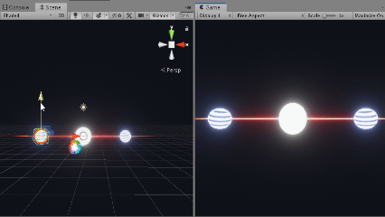

# 유니티 프로그래밍
이번 챕터에서는 유니티 C# 프로그래밍에서 사용되는 프로그래밍에 대해 본격적으로 설명드리고자 합니다. 유니티에서 사용되는 C# 언어는 C/C++ 언어, 특히 Java 언어의 문법과 상당히 유사하기 때문에, 이전에 프로그래밍 경험이 있으시다면 빠르게 적응하실 수 있을 것입니다.


**왜 유니티 엔진은 C# 언어를 사용하나요?**
> 사실, 유니티 엔진의 핵심 코드는 거의 C++언어로 작성되어 있습니다. 하지만, 정작 우리가 유니티 엔진에서 프로그래밍을 할 때에는 C# 언어를 사용합니다. 이것이 가능한 이유는 유니티 엔진에서 C# 프로그래밍을 통해서도 C++언어로 작성된 엔진을 컨트롤 할 수 있도록 만들어놓았기 때문입니다.

>그렇다면 C++보다 C#을 활용해서 얻게되는 장점이 무엇일까요?

__1. C/C++과 같은 low-level 언어보다 배우고 활용하기 쉽습니다.__
C# 같은 경우, 메모리 관리와 같이 까다롭고 복잡한 작업을 기본적으로 언어 차원에서 지원합니다. 일반적으로는 c#/Java와 같은 Managed 언어가 C++ 언어보다 훨씬 쉽게 익히고 배울 수 있습니다.

__2. 일반적으로, C#은 Java 나 Python 같은 다른 언어 보다 뛰어난 성능을 보입니다.__
C/C++보다는 성능이 떨어지지만, Java나 Python 같은 주요 언어들보다는 성능이 높기 때문에 성능과 편의성에 있어서 타협할 수 있습니다.

이와 같은 특징 때문에 유니티 엔진이 타 게임 엔진보다 진입 장벽이 낮고 활용이 편리하다는 장점을 가지게 되었습니다.


## 기본 자료형
유니티 프로그래밍에서 가장 많이 쓰이는 데이터 타입들에 대해서 알아보겠습니다.


### int
4바이트 정수형 데이터 타입입니다. 개수, 카운트 변수 등 정수 개념을 다룰 때에는 `int`를 사용합니다.
```cs
int num = 3;
```

### float
4바이트 실수형 데이터 타입입니다. 시간, 비율, 좌표 등 실수 개념을 다룰 때에는 `float`를 사용합니다.

```cs
float time = 3.0f;
```
`double`과 구분하기 위해, float 리터럴을 입력할 때는 숫자 뒤에 `f`를 붙여야 합니다.

**알아두세요**
>일반적으로 많이 쓰이는 실수 자료형 중에서는 `double`도 있지만, 유니티 엔진에서는 정밀도는 낮지만 메모리 크기와 연산 성능이 뛰어난 `float` 자료형을 주로 사용합니다.

#### Mathf 클래스
`Mathf`는 우리가 프로그래밍을 할 때 많이 사용하는 수학적 연산을 수행하는 함수들을 가지고 있는 라이브러리 클래스입니다(C언어의 Math 라이브러리와 비슷합니다).

#### Abs
주어진 값의 절대값을 반환하는 함수입니다. 주어진 값이 양수나 0이면 그대로 반환하지만, 음수이면 값을 양수로 바꾸어 반환합니다.

```cs
Debug.Log(Mathf.Abs(-10.5f));

```

#### Min, Max
`Min`함수는 입력받은 두 개의 인자 중, 더 작은 값을 반환합니다. 반면, `Max` 함수는 입력받은 두 개의 인자 중, 더 큰 값을 반환합니다.


```cs
float min = Mathf.Min(1, 5);
float max = Mathf.Max(1, 5);


Debug.Log(min); //결과: '1' 출력.
Debug.Log(max); //결과: '5' 출력.
```

##### Clamp
Clamp는 어떤 값이 항상 주어진 범위내에 존재하도록 값을 제한하는 함수입니다.
```cs
float a = Mathf.Clamp(1, 5, 3);
float b = Mathf.Clamp(1, 5, 0);
float c = Mathf.Clamp(1, 5, 7);

Debug.Log(a); //결과: '3' 출력.
Debug.Log(b); //결과: '1' 출력.
Debug.Log(c); //결과: '5' 출력.
```


##### Lerp
`Lerp`는 Linear Interpolation의 약자로, 선형 보간 연산을 수행할 수 있는 함수입니다.

첫번째 인자는 시작 값, 두 번째 인자는 끝 값을 의미하며, 세번째 인자는 첫 번째, 두번째 보간하기 위해 사용하는 보간 변수로, 0~1사이의 값을 가집니다.

세번째 인자 값이 0에 가까워 질 수록 시작값에 가까워지며, 1에 가까워질수록 끝값에 가까워집니다. 따라서, 보간 값을 적절하게 조절하여 범위 사이의 값을 얻고자 할 때 사용합니다.


```cs
float a = Mathf.Lerp(0, 10, 0.3f);
float b = Mathf.Lerp(0, 10, 0.7f);
float c = Mathf.Lerp(0, 10, 0f);
float d = Mathf.Lerp(0, 10, 1f);

Debug.Log(a); //결과: '3' 출력.
Debug.Log(b); //결과: '7' 출력.
Debug.Log(c); //결과: '0' 출력.
Debug.Log(d); //결과: '10' 출력.

```

##### Sin, Cos, Tan...
삼각함수와 관련된 다양한 연산도 Mathf를 통해서 수행할 수 있습니다.

```cs
float t = 1;

float sin = Mathf.Sin(t); //Sin 값 반환
float cos = Mathf.Cos(t); //Cos 값 반환
float tan = Mathf.Tan(t); //Tan 값 반환
```
__알아두세요__
> Mathf의 Sin, Cos, Tan과 같은 삼각함수는 각도(Degree)가 아니라 라디안(radian) 값을 기준으로 계산합니다.

##### PI
원주율(3.1415926535897...)값을 나타내는 상수입니다.

```cs
float radius = 5.0f;

//원의 둘레를 PI를 이용하여 구할 수 있다.
float perimeter = 2 * Mathf.PI * radius;
```

### bool
참/거짓을 표현하는 boolean 기본 데이터 타입입니다.

```cs
bool isMine = false;
```

## string
문자열을 표현하는 데이터 타입입니다. `string`은 문자열을 표현할 문자열과 관련된 여러가지 기능들이 지원됩니다.

```cs
string name;
```


특히, 문자열끼리 서로 더하기 연산을 수행하여 문자열을 합칠수도 있습니다.
```cs
string firstName = "John";
string lastName = "Doe";

string name = "John" + " "+ "Doe";

Debug.Log(name);
//결과: name => "John Doe"
```

##  Vector3
- x, y, z 3개의 float 값으로 구성된 3차원 벡터를 표현하는 구조체 자료형입니다.
- 3차원 정보인 Position(위치), Euler Angles(회전)등을 표현하기 위해 주로 사용됩니다.
```cs
//Transform에서 위치 정보를 Vector3 자료형으로 가져올 수 있습니다.
Vector3 position = transform.position;

//직접 원하는 값의 Vector3를 생성할 수도 있습니다.
Vector3 a = new Vector3(1,2,3);
Vector3 b = new Vector3(4,5,6);
```
Vector3는 다양한 연산들을 지원하는 메소드를 가지고 있습니다.

Dot Product

```cs
//Dot product 연산
float magnitude = a.magnitude;
//
float distance = Vector3.Distance(a, b);

float dot = Vector3.Dot(a, b);
```
#### magnitude
주어진 벡터의 크기를 계산합니다.

```cs

float magnitude = a.magnitude;

```
#### distance
두 벡터 사이의 거리를 계산합니다.
```cs
float distance = Vector3.Distance(a, b);
```


### Example: 두 물체 사이의 중점 구하기
이제 `float`, `Vector3`, 'string'를 활용하는 것을 연습해보기 위해 두 GameObject 사이의 중점을 구하고, 그 위치에 다른 GameObject를 배치하는 간단한 예제 프로그램을 만들어봅시다.


먼저, 두 GameObject의 position 값을 새로운 `Vector3`에 할당하는 연습을 해봅시다.

```cs
public GameObject firstObject;
public GameObject secondObject;

public GameObject midObject;

void Update()
{
  //GameObject의 transform에 접근하여 position 값을 가져옵니다.
  Vector3 firstPos = firstObject.transform.position;
  Vector3 secondPos = secondObject.transform.position;

}
```
여기서 `firstPos`는 첫번째 GameObject의 position 값을 가지며, `secondPos`는 두 번째 GameObject의 position을 가지게 됩니다. 이렇게 새로운 Vector3에 필요한 값을 저장해두면, position값이 필요할때마다 매번 GameObject를 거쳐서 transform에 접근할 필요 없이 바로바로 사용할 수 있다는 장점이 있습니다.

이제 `firstPos`와 `secondPos`사이의 중점을 계산해봅시다. 두 점의 중점을 계산하는 방법은 아주 간단합니다. 두 위치 벡터의 합을 2로 나누면 중점 위치를 나타내는 벡터를 구할 수 있습니다. 이 과정을 코드로 나타내면 아래와 같습니다.

```cs
//방법1: Vector3의 덧셈/나눗셈 활용
Vector3 midPos = (firstPos + secondPos)/2;
```

위의 방법보다 복잡하기는 하지만, Vector3 활용을 더 연습해보기 위해 조금 다른 방식으로 중점의 위치를 구해봅시다.
```cs
//방법2: 두 지점 사이의 거리와 차이 벡터를 이용
 float distance = Vector3.Distance(firstPos, secondPos);
 Vector3 diffVector = (secondPos - firstPos).normalized;

 Vector3 midPos = firstPos + diffVector * (distance/2);
```

이제 우리가 구한 위치 벡터를 중간 위치에 배치할 오브젝트의 transform.position값으로 설정해줍시다.
```cs
midObject.transform.position = midPos;
```
#### 실행 결과


중간에 흰색 오브젝트가 항상 양쪽에 존재하는 오브젝트에 중간 지점에 위치하게 됩니다.
