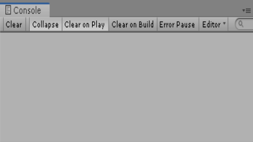
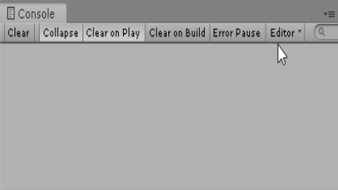

# Input 처리
게임과 같이 사용자와 상호작용 가능한 컨텐츠를 제작할 때, 사용자의 입력을 인지하고 처리하는 기능은 아주 중요합니다. 유니티 엔진에서는 입력과 관련된 처리를 쉽게 사용할 수 있도록 다양한 기능을 제공하는 Input 클래스를 제공합니다.

그러면 이제부터 Input 클래스를 통해서 사용자의 마우스 입력과 키보드 입력을 처리할 수 있는 방법을 알아보도록 하겠습니다.

 ## 1. 마우스 입력

### 마우스 포인터 위치
화면에서의 마우스의 포인터 이동에 대한 정보를 가져옵니다.

```cs
Vector3 mousePosition = Input.mousePosition;
```
mousePosition은 현재 프레임에서 마우스 포인터가 위치해있는 Screen에서의 픽셀 위치를 나타내며, 실제 3D 공간상에서의 좌표와는 다릅니다.  


__알아두세요__
>Input.mousePosition을 사용해서 매 프레임마다 마우스 위치의 변화값을 계산할 수도 있습니다. 이전 프레임에서의 mousePosition을 기록하는 Vector3 멤버변수를 사용해서, 이전 프레임과 현재 프레임에서의 마우스 위치 변화를 계산합니다.

```cs

Vector3 lastMousePosition;

void Update()
{
  Vector3 deltaMousePosition = Input.mousePosition - lastMousePosition;
  //이번 프레임
  lastMousePosition = Input.mousePosition;
}

```


### 마우스 입력

#### 마우스 버튼 코드
일반적으로 마우스에는 왼쪽, 오른쪽, 가운데(마우스 휠)의 3가지 버튼이 존재합니다. 유니티에서는 이 버튼들을 아래와 같이 `int`값으로 표현합니다.


|int 값| 마우스 버튼|
|-|-|
|0| 마우스 왼쪽 버튼|
|1| 마우스 오른쪽 버튼|
|2| 마우스 휠 버튼|


#### 함수
 - `Input.GetMouseButtonDown('마우스 버튼 코드')`
 마우스 버튼을 처음 눌렀을 때 한 번만 실행하고 싶을 때 사용합니다.
 - `Input.GetMouseButton('마우스 버튼 코드')`
 마우스 버튼을 누르고 있을 때 반복해서 실행하고 싶을 때 사용합니다.
 - `Input.GetMouseButtonUp('마우스 버튼 코드')`
 마우스 버튼을 누르고 있다가 떼었을 때 한 번만 실행하고 싶을 때 사용합니다.

####예제 코드
위에서 설명 드린

```cs
void Update(){
  // 마우스 왼쪽 버튼 클릭시에 한 번 실행
  if(Input.GetMouseButtonDown(0))
  {
      Debug.Log("Mouse Clicked!");
  }
  // 마우스 버튼 클릭 하는 동안 계속 실행
  else if(Input.GetMouseButton(0))
  {
      Debug.Log("Mouse Clicking!");
  }
  // 마우스 버튼을 놓았을 때 한 번 실행
  else if(Input.GetMouseButtonUp(0))
  {
      Debug.Log("Mouse Released!");
  }
}
```
#### 실행 결과



### 키보드 입력
키보드에는 아주 많은 수의 버튼이 존재하기 때문에, 마우스 버튼 처럼 0, 1, 2..이런 식의 정수로 나타내기 어렵습니다. 따라서, 키 입력에서는 KeyCode라는 enum 형식의 데이터 타입을 사용하여 Key 버튼의 종류를 구분합니다.

### KeyCode
Enter, Esc, Enter, Space키 그리고 숫자 키와 알파벳 키 등등 키보드에 있는 버튼들이 지정되어 있습니다. 몇 가지를 예시를 들자면 아래와 같습니다.

|`KeyCode` enum 값| 키보드 버튼|
|-|-|
|KeyCode.Space| Space 키|
|KeyCode.Return| Return(엔터) 키|
|KeyCode.W| 알파벳 W 키|


### 함수
마우스 입력과 마찬가지로, Key 입력에도 입력을 확인하는 함수가 존재합니다.

어떤 키가 눌렸는지 확인하기 위해서는 그 키에 대한 KeyCode를 찾아서 아래의 함수의 인수로 넣어주면 됩니다.

 1.	`Input.GetKeyDown(KeyCode keyCode)`
 키보드 버튼을 처음 눌렀을 때 한 번만 실행하고 싶을 때 사용합니다.
 2.	`Input.GetKey(KeyCode keyCode)`
키보드 버튼을 누르고 있을 때 반복해서 실행하고 싶을 때 사용합니다.
 3.	`Input.GeyKeyUp(KeyCode keyCode)`
 키보드 버튼을 누르고 있다가 떼었을 때 한 번만 실행하고 싶을 때 사용합니다.

###  예시코드

 ```cs
 void Update(){
   // Space 키 눌렀을 때 한 번 실행
   if(Input.GetKeyDown(KeyCode.Space))
   {
       Debug.Log("Space Pressed!");
   }
   // Space 키를 누르는 중에 계속 실행
   else if(Input.GetKey(KeyCode.Space))
   {
       Debug.Log("Space Pressing!");
   }
   // Space 키를 누르다가 놓았을 때 한 번 실행
   else if(Input.GetKeyUp(KeyCode.Space))
   {
       Debug.Log("Space Released!");
   }
 }
 ```
 #### 실행 결과
 
