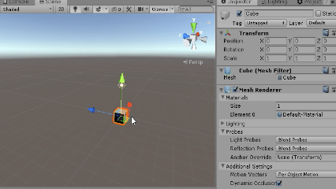
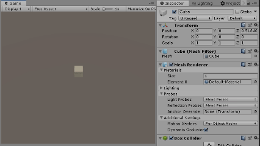

# Time
이전 EventFunction 예제에서 Update 함수에서 Cube를 앞으로 움직이는 간단한 예제 프로그램을 작성했었습니다. 하지만 그때도 언급했었듯이, Cube가 우리가 의도한대로 움직이지 않았습니다. 이번 챕터에서는 왜 그런 현상이 발생했는지, 그리고 유니티의 Time클래스를 활용해서 이 문제를 어떻게 해결할 수 있는지 알아보겠습니다.

## Time Dependent vs Time Independent

 ```cs
 //Bad Code 예시
 void Update()
 {
   transform.position += Vector3.forward;
 }
 ```

 앞의 예제에서 오브젝트가 1초에 1m만큼 이동하기를 원했지만, 실제 실행을 해보면 그보다 훨씬 빨리 움직이는 것을 확인하셨을 것입니다. 그뿐만 아니라, 뭔가에 걸린 것처럼 끊기는 듯이 이동하는 것도 확인할 수 있습니다.



> 도무지 1초에 1만큼 움직이는 것으로는 보이지 않는다.

 왜 이런 오류 현상이 발생하는 것일까요?

 ## Update() 함수 다시 살펴보기

 `Update` 함수는 일정한 시간간격 마다 실행되는 것이 아니라 한 프레임마다 한 번씩 실행됩니다. 보통, 일반적인 애플리케이션은 1초에 60 ~ 90 fps정도로 실행되는데, 이것은 Update 함수도 동일한 주기, 즉 1초에 60~90회 실행된다는 것을 의미합니다. 따라서, 단순히 아래와 같이 이동 코드를 작성했다면, 실제로는 1초에 60 ~ 90m씩 이동하게 되는 것입니다.

그뿐만 아니라, 한 프레임 당 작업하는 데 소모되는 시간이 매번 다를 수 밖에 없기 때문에, Update 함수의 실행주기는 매우 불규칙적입니다. 이전에 제시한 예시에서 오브젝트가 끊기는 듯이 이동하는 현상은 바로 이것 때문입니다.


|실행 환경|평균 초당 프레임 수| 평균 이동 속도 |
|--|--|--|
|PC 1| 평균 60fps|60m|
|PC 2| 평균 90fps| 90m|

> 어떤 PC에서 실행되느냐에 따라서 물체의 이동거리와 속도가 달라질 수 있다.  


 이와 같이, 애플리케이션의 실행 속도에 따라서, 수행 결과가 달라지는 것을 **Frame Dependent**, 즉 프레임 주기에 의존적이라고 부릅니다. 일반적으로, 물체의 이동과 같은 코드는 Application 실행 환경에 따라서 매번 결과가 달라지면 안되기 때문에, 가급적이면 Frame Dependent 현상이 발생하지 않도록 해야 합니다.

 ## Time 클래스

 그렇다면 이러한 문제를 어떻게 해결해야 할까요? 가장 간단한 방법은 `Update` 함수에서 물체를 이동시킬 때, **프레임과 프레임 사이의 시간간격에 비례** 한 거리만큼 움직이도록 만드는 것입니다. 유니티에서는 매 프레임마다 소모된 시간을 `deltaTime`이라고 부르며, 이 정보는 `Time` 클래스에서 받아올 수 있습니다.


 1. `Time.deltaTime`
 이전 프레임과 현재 프레임 사이의 시간 간격을 의미합니다. 매 프레임마다 실행되어야 하지만, 실제 시간에 비례하게 실행되는 것처럼 만들어야 할 때 사용됩니다.

 ```cs
Debug.Log(Time.deltaTime);
 ```

 2. `Time.time`
 Scene이 실행된 후, 경과한 총 시간을 의미합니다. 시간 간격이 아니라 누적된 시간 정보가 필요할 때 많이 사용됩니다.
 ```cs
Debug.Log(Time.time);
 ```


## Frame Independent 하게 만들기
이제 `Time`클래스의 `deltaTime` 정보를 활용해서 불규칙적인 현상들로 가득한 Frame Dependent의 세계에서 벗어나봅시다. 방법은 정말 간단합니다. 우리가 원하는 물체의 실제 이동 속도에 `Time.deltaTime`을 곱해주면 됩니다. 그렇게 하면 매 프레임당 걸린 시간에 비례한 이동거리를 구할 수 있으며, 그 값을 원래의 현재의 위치 값에 더해주면 이번 프레임에서의 위치를 구할 수 있습니다.

```cs
void Update(){
  // 이제 y축 방향으로 초당 1의 속도로 이동합니다.
  transform.position += Vector3.forward * Time.deltaTime;
}
```

이제 결과를 한 번 확인해봅시다.


이제 Cube가 정상적으로 1초에 1씩 정상적으로 움직이는 것을 확인할 수 있습니다. Cube의 움직임도 훨씬 부드러워진 것 같습니다.
