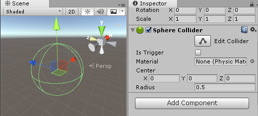
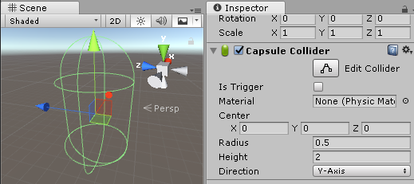

# Intro

물리 효과를 활용할 수 있는 대표적인 Component를 사용하는 방법

## Rigidbody

### Force

### AddForce

### AddExplosion

## Collider
Collider는 물리 시뮬레이션에서 충돌 판정을 위한 형태를 정의합니다.

## Primitive Collider (기본 콜라이더)
Primitive Collider 는 아주 단순한 형태를 가진 Collider 입니다.

* Sphere Collider
구체 형태의 Collider로, 반경을 조정하여 크기를 조절할 수 있습니다.

* Box Collider
육면체 형태의 Collider로, 육면체의 중심 위치와 크기 등을 조절할 수 있습니다.

* Capsule Collider
캡슐 형태의 Collider로, 캡슐의 반경과 높이 등을 조절할 수 있습니다.

## Mesh Collider (메시 콜라이더)
MeshCollider는 오브젝트의 Mesh를 Collider로 사용합니다.
실제 Mesh 형태와 Collider의 형태가 일치하기 때문에 더 정확한 충돌 효과를 연출할 수 있습니다.

## Primitive Collider VS Mesh Collider

일반적으로, Mesh Collider는 복잡한 형태를 가진 Collider가 필요할 때 사용합니다.

하지만 MeshCollider는  기본 콜라이더를 여러개 사용하는 것보다도 오버헤드가 많이 발생합니다.

따라서, 복잡한 형태를 가진 Collider가 필요하다면, 오버헤드가 큰 MeshCollider를 사용하기 보다는 Primitive Collider 여러 개를 적절하게 조합하여 사용하는 것이 권장됩니다.

다만, 오버헤드를 감수하고 더 정확한 형태의 Collider와 충돌 판정이 필요하다면, MeshCollider를 선택하

#### 예제: Grenade 폭발 효과
앞에서 배운 내용을 활용해서

### Physics 클래스
유니티 엔진에서는 물리 효과를 사용할 수 있는
