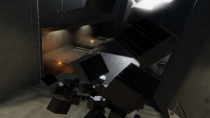
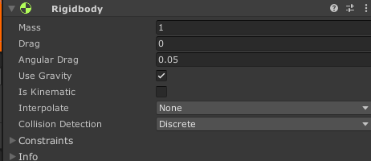

# Rigidbody



Rigidbody는 유니티 엔진에서 물리효과를 연출할 수 있는 Component입니다. Rigidbody를 가진 GameObject는 유니티 엔진의 물리 엔진에 영향을 받아 속도, 중력, 충돌 판정 등의 작업을 수행할 수 있게 됩니다.



## AddForce

Rigidbody를 통해서 물체에 물리적 힘을 가하는 효과를 만들 수 있습니다. 예를 들어, 공을 던지거나 포탄을 발사하는 효과를 만들 때 사용할 수 있습니다.

```cs
public class ExampleClass : MonoBehaviour
{
    public float thrust = 1.0f;
    public Rigidbody rb;

    void Start()
    {
        rb = GetComponent<Rigidbody>();
    }

    void FixedUpdate()
    {
        rb.AddForce(transform.forward * thrust);
    }
}
```

## AddExplosionForce

Rigibody에 **폭발** 효과를 연출할 수 있는 힘을 가합니다. 예를 들어, 폭탄이 폭발할 때 주변 물체가 폭발에 휩쓸려 날아가는 효과를 만들어낼 때 사용할 수 있습니다. AddExplosionForce 함수는 기본적으로 아래의 3가지의 정보를 사용합니다.

|Arguments|설명|
|-|-|
|explosionForce|폭발력. 폭발 지점에서 나오는 힘의 세기|
|explosionPosition	|폭발이 시작되는 중심 위치.|
|explosionRadius| 폭발 최대 반경. 즉, 폭발력이 미치는 힘의 범위.|

```cs
// Applies an explosion force to all nearby rigidbodies
public class ExampleClass : MonoBehaviour
{
    public float radius = 5.0F;
    public float power = 10.0F;

    void Start()
    {
        Vector3 explosionPos = transform.position;
        Collider[] colliders = Physics.OverlapSphere(explosionPos, radius);
        foreach (Collider hit in colliders)
        {
            Rigidbody rb = hit.GetComponent<Rigidbody>();

            if (rb != null)
                rb.AddExplosionForce(power, explosionPos, radius);
        }
    }
}
```


## Physics 클래스

Physics는 유니티에서 물리 엔진 기능을 직접적으로 사용할 수 있는 클래스 입니다. 대표적으로 특정 지점에서 Ray를 발사하여 Collider를 감지하는 Raycast와 주변 영역 내의 Collider를 감지하는 OverlapSphere와 같은 기능들이 있습니다.


### Raycast
Raycast는 한 지점에서 특정 방향으로 가상의 Ray를 쏴서, 그 Ray와 충돌하는 Collider가 있는지 검사하는 기능입니다. 레이캐스트는 RigidBody와 같은 다른 컴포넌트를 사용할 필요 없이 스크립트 상에서 쉽게 사용할 수 있기 때문에, 단순한 Collider 감지 기능이라면 Raycast를 사용하는 것이 매우 편리합니다.

```cs
public static bool Raycast(Vector3 origin, Vector3 direction, float maxDistance = Mathf.Infinity, int layerMask = DefaultRaycastLayers);
```

```cs
void Update()
   {
      ///Ray와 Collider 와의 충돌 정보를 저장하는 객체.
       RaycastHit hit;

       // transform의 전방으로 Ray를 발사하여 Raycast 수행.
       if (Physics.Raycast(transform.position, transform.forward, out hit, Mathf.Infinity))
       {
           Debug.Log("Did Hit");
       }
       else
       {
           Debug.Log("Did not Hit");
       }
   }
```


### OverlapSphere
OverlapSphere는 한 지점에서 특정 구(Sphere) 영역 내에 존재하는 Collider가 있는지 검사하는 기능입니다. Raycast와는 다르게 방향은 필요 없지만 Collider 감지 반경을 설정해주어야 합니다.

```cs
void Update()
   {
      ///Range값에 해당하는 구 반경 내의 Colldier를 감지한다.
       Collider[] colliders = Physics.OverlapSphere(transform.position, Range);
   }
```
