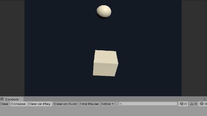

#Collider와 충돌 이벤트 함수
이전 예제에서 RigidBody 컴포넌트를 활용하여 Grenade 오브젝트에 중력, 힘과 같은 물리적 효과를 적용해보았습니다. 하지만, Grenade 바닥이나 벽에 부딪히지 않고 뚫고 지나가는 것을 확인할 수 있었습니다. 어떻게 하면 Grenade가 주변 물체와 부딪혀서 튕기는 효과를 만들 수 있을까요?


> Rigidbody를 적용한 물체들이 바닥에 부딪히지 않고 그냥 뚫고 내려가는 문제점이  


##Collider란?
Collider는 물리 엔진이 물리 시뮬레이션을 수행할 때, 충돌을 검사하기 위한 영역을 정의합니다. RigidBody가 물체의 물리적 성질을 표현한다면, Collider는 물체의 물리적 형태를 정의한다고 볼 수 있습니다. 물리 엔진은 두 Collider가 서로 충돌한 상태인지, 충돌 했다면 어떤 방향/힘으로 충돌이 발생했는지 등 연산을 통해 물리 시뮬레이션을 수행합니다. 이러한 물리 시뮬레이션을 수행하게 되면

Collider는 크게 Primitive Collider와 Mesh Collider 2가지가 존재합니다. 이제부터 이 2가지 Collider에 대해 알아봅시다.


## Primitive Collider (기본 콜라이더)
기본 콜라이더는 유니티에서 제공되는 가장 단순한 형태를 가진 Collider 입니다. 일반적으로, 이 3가지 형태의 Collider를 적절히 조합하는 것만으로도 다양한 형태를 만들어낼 수 있습니다. Primitive Collider는 형태가 매우 단순하고 정해져 있기 때문에 충돌 연산 비용이 비교적 저렴합니다.

유니티 3D 환경에서는 아래의 3가지 종류의 Primitive Collider를 제공합니다.

### Sphere Collider
구체 형태의 Collider로, 반경을 조정하여 크기를 조절할 수 있습니다.


Sphere Collider는 공처럼 둥글고 굴러가기 좋은 형태의 물체의 Collider로 사용하는 데 적합합니다.

### Box Collider
육면체 형태의 Collider로, 육면체의 중심 위치와 크기 등을 조절할 수 있습니다.


Box Collider는 상자와 바닥 등, 각지고 평면적인 형태를 가진 물체의 Collier로 사용하는 데 적합합니다.

### Capsule Collider
캡슐 형태의 Collider로, 캡슐의 반경과 높이 등을 조절할 수 있습니다.


Capsule Collider는 사람 몸체, 유리병 등 둥글고 긴 형태를가진 물체의 Collider로 사용하는 데 적합합니다.


## Mesh Collider (메시 콜라이더)
MeshCollider는 임의의 Mesh를 Collider로 사용할 수 있도록 만들어주는 Collider입니다. Primitive Collider보다 훨씬 더 다양하고 복잡한 형태를 충돌 판정에 사용할 수 있기 때문에, 더 섬세한 충돌 효과를 연출하는 것이 가능합니다.


## Primitive Collider VS Mesh Collider

Mesh Collider는 기본 콜라이더에서 정의되지 않는 복잡한 형태를 Collider로 시용할 수 있다는 장점이 있습니다. 하지만, 일반적으로 Mesh Collider는 기본 Collider보다 훨씬 더 높은 성능을 요구합니다. 특히, 사용하는 Mesh의 복잡도에 따라서는 기본 콜라이더를 여러 개 사용하는 것보다도 더 많은 오버헤드가 발생할 수 있습니다.


따라서, MeshCollider를 사용하기 전에 정말 MeshCollider를 사용할 필요가 있는지 신중하게 고민할 필요가 있습니다. 복잡한 형태를 가진 Collider가 필요하다면, 오버헤드가 큰 MeshCollider를 사용하는 것 보다는 Primitive Collider 여러 개를 적절하게 조합하여 사용하는 것이 좋습니다. 특히, 성능이 중요한 게임 컨텐츠에서는 캐릭터의 충돌영역을 구현할 때 복잡한 캐릭터의 Mesh를 그대로 사용하기 보다는 여러 개의 Primitive Collider들을 캐릭터 형태에 비슷하게 맞추어서 사용하기도 합니다.


> 사람 캐릭터에 여러개의 Primitive Collider를 적용한 예시. MeshCollider를 사용하지 않고도 Sphere, Capsule, Box collider를 적절히 조합하여 캐릭터 몸체에 얼추 맞는 형태를 만들어 낼 수 있습니다.


하지만, 그렇다고 항상 Primitive Collider를 사용하라는 것은 아닙니다. 상당한 오버헤드를 감수하더라도 더 정확한 형태의 Collider와 충돌 판정이 필요한 상황이라면 MeshCollider를 사용하는 것이 훨씬 더 정확한 결과를 얻을 수 있습니다. 물론 이 경우에도 아주 복잡한 Mesh 대신 형태는 비슷하되 조금 더 단순한 구조의 Mesh를 사용할 수 있다면 훨씬 더 좋은 성능을 얻을 수 있습니다. 결론적으로 필요에 따라서 적절한 Collider를 선택하는 것이 중요합니다.


## 충돌 판정
앞에서 물리적 성질을 정의하는 RigidBody와 물리적 형태를 정의하는 Collider에 대해 배웠으니, 이제는 두 오브젝트 간의 충돌을 만들 수 있습니다.

유니티 엔진에서 오브젝트 간의 충돌을 발생시키기 위해서는 반드시 아래의 조건들을 모두 만족해야 합니다.

  1. 두 오브젝트 중 하나는 반드시 활성화된 RigidBody를 가지고 있어야 한다.
  2. 두 오브젝트 모두 Collider를 가지고 있어야 한다.

위의 조건이 만족되면, 두 Collider가 서로 '충돌'할 수 있으며, 스크립트를 통해서 이 충돌과 관련된 작업을 처리할 수 있게 됩니다.

## Collision 이벤트 함수
두 Collider 간에 충돌이 감지되면, 물리 엔진은 충돌이 발생했다는 것을 알려주는 **충돌 이벤트 함수** 를 호출합니다. 우리가 이전에 배웠던 `Start`, `Update` 함수 와 같이, 충돌 이벤트 함수는 충돌 상황에 따라서 호출되는 **특수한 유니티 이벤트 함수** 의 일종입니다. 따라서, 충돌과 관련된 작업을 프로그래밍 하기 위해서는 유니티에서 정의한 몇 가지 이벤트 함수를 구현하면 됩니다.

```cs
public class ExampleClass : MonoBehaviour
{

    void Start()
    {

    }

    void OnCollisionEnter(Collision collision)
    {
        //충돌이 발생하면 OnCollisionEnter 함수가 호출됩니다.

    }
}
```

모든 Collision 이벤트 함수는 충돌이 발생했을 때의 정보를 가지고 있는 `Collision` 객체를 전달받습니다. `Collision` 객체는 충돌한 대상, 충돌이 발생한 지점, 충격 속도 등 충돌이 발생했을 때와 관련된 정보를 가지고 있습니다. 따라서, Collision 객체가 가진 정보를 활용하여 충돌 상황에 대해 파악할 수 있으며 처리 작업에 사용할 수 있습니다.

Collision 이벤트 함수는 충돌 상태에 따라서 3가지로 구분됩니다.

### OnCollisionEnter
다른 Collider와의 충돌 상태가 처음 시작되었을 때 호출되는 이벤트 함수입니다.

#### 예제 코드:
```cs

  void OnCollisionEnter(Collision collision)
  {
      Debug.Log("충돌이 시작되었습니다.");
  }
```
두 콜라이더 사이에 충돌이 발생하면 로그를 출력하도록 스크립트를 작성하였습니다. 실제로 충돌이 발생할 때 이 로그가 출력되는 지 확인해 봅시다.

#### 실행 결과:


공이 상자 위로 떨어져 충돌하는 순간, 로그가 출력되는 것을 확인할 수 있습니다. 충돌이 처음 이후로도 계속 접촉하고 있음에도 불구하고 `OnCollisionEnter`는 한 번만 실행된 것에 주목하시기 바랍니다. 이와 같이, 충돌이 처음 발생한 그 순간에 대한 작업을 처리할 때에는 `OnCollisionEnter`를 사용하면 된다는 것을 알 수 있습니다.


### OnCollisionStay
다른 Collider와 처음 충돌이 발생한 이후로, 충돌 상태가 유지되는 동안 계속 호출되는 함수입니다.

#### 예제 코드:
```cs
void OnCollisionStay(Collision collision)
{
    Debug.Log("충돌 상태가 유지되고 있습니다.");
}
```

충돌 상태가 유지된다는 것은 두 콜라이더가 계속 접촉하고 있거나 겹쳐있는 상태를 의미합니다. 이번에는 로그가 어떻게 출력되는지 한 번 확인해봅시다.

#### 실행 결과:


공이 상자 위로 떨어진 후, 어느 정도 굴러서 떨어지는 상황을 만들어서 스크립트를 실행해 보았습니다. Console 화면을 확인해보면, 공이 상자 위를 구르면서 접촉한 상태에서는 로그가 지속적으로 출력되는 것을 확인할 수 있었습니다. 또한, 공이 상자 위에서 떨어지게 되면 더이상 로그가 출력되지 않습니다. 이를 통해서, 두 콜라이더가 충돌을 시작한 이후로 서로 떨어지지 않고 접촉/충돌이 계속되는 상황에서 호출되는 함수라는 것을 확인할 수 있습니다.


### OnCollisionExit
다른 Collider와의 총돌 상태에서 빠져나왔을 때 호출되는 함수입니다.
```cs
void OnCollisionExit(Collision collision)
{
    Debug.Log("충돌 상태에서 벗어났습니다.");
}
```

#### 실행 결과:


 Console 화면을 확인해보면, 공이 상자 위에 떨어진 이후 굴러서 낙하하는 순간 로그가 출력되는 것을 확인할 수 있었습니다. 또한, 공이 상자 위에서 떨어지는 순간 한 번 출력된 이후로는 계속 출력되지 않습니다. 이를 통해서, 두 콜라이더가 충돌을 시작한 이후, 충돌 상황에서 벗어난 순간에 호출되는 함수라는 것을 확인할 수 있습니다.


## 예제: 충돌 시 폭발하는 시한폭탄 만들기
앞에서 만들었던 시한 폭탄 예제를 확장해서 시한 폭탄이 그냥 터지는 게 아니라 바닥이나 벽 등 주변 물체에 충돌한 뒤에 폭발하는 기능을 추가해봅시다. 시한 폭탄이 주변 Collider와 충돌할 수 있도록 시한 폭탄 오브젝트에 Collider를 추가하고, 스크립트에서 충돌이 발생했을 때 폭발이 시작하는 기능은 `OnCollisionEnter` 이벤트 함수를 사용하면 구현할 수 있을 것 같습니다.


### 1. Rigidbody 및 Collider 설정

먼저, 폭탄 오브젝트가 주변 Collider와 충돌하기 위해서는 Collider를 추가해주어야 합니다. 폭탄 오브젝트에 Sphere Collider 컴포넌트를 추가하여 충돌이 발생하도록 만들어 봅시다.


또한, 폭발에 휩쓸려 날아가는 상자 오브젝트에도 콜라이더를 설정해 주어야 할 것 같습니다.


상자에 형태에 맞게 BoxCollider를 사용하여 충돌 영역을 적절하게 설정해 주었습니다. 물론 상자의 형태와 정확히 일치하지는 않지만, 이 정도면 충분히 괜찮은 물리 효과를 연출할 수 있습니다.

### 2. OnCollisionEnter 구현

콜라이더를 설정해 주었으면 이제 오브젝트간에 충돌이 발생하게 될 것입니다. 이제 TimeBomb 스크립트에서 충돌 이벤트 함수를 구현해봅시다,

### 예제코드:
```cs
/// <summary>
/// 이 오브젝트의 콜라이더가 다른 콜라이더에 충돌했을 경우, 실행되는 함수입니다.
/// </summary>
private void OnCollisionEnter(Collision collision)
{
    if (!hasExploded)
    {
        Explode();
    }
}


/// <summary>
/// 폭탄이 폭발했을 때의 작업을 처리합니다.
/// </summary>
void Explode()
{
    //폭발이 2번 발생하지 않도록
    hasExploded = true;

    //OverlapSphere를 사용하여 범위 내에 존재하는 모든 Collider의 배열을 가져옵니다.
    Collider[] colliders = Physics.OverlapSphere(transform.position, ExplosionRange);

    foreach(var collider in colliders)
    {
        Rigidbody rb = collider.attachedRigidbody;

        //어떤 Collider는 Rigidbody를 가지고 있지 않을 수 있습니다.
        //따라서 이 경우는 예외로 처리하여 아무런 작업을 수행하지 않습니다.
        if(rb == null || collider == BodyCollider) continue;

        //Collider가 Rigidbody를 가졌을 경우, 폭발 효과를 연출할 수 있도록 AddExplosionForce를 사용합니다.
        rb.AddExplosionForce(ExplosionForce, transform.position, ExplosionRange);
    }

    ExplodeParticleObject.SetActive(true);
    BodyRenderer.enabled = false;

    //폭발 시점에서의 Light 효과를 아주 밝게 설정합니다.
    BodyLight.intensity = 8f;
    BodyLight.range = 8f;

    Destroy(gameObject, 3f);
}
```

### 실행 결과

폭탄 오브젝트가 바닥에 충돌하는 순간, 폭발 효과가 발생하는 것을 확인할 수 있습니다. 그 뿐만 아니라, 상자 오브또한 벽이나 주변 오브젝트에 부딪히면서 날아가는 것을 확인할 수 있습니다. 이와 같이, Rigidbody와 Collider 그리고 충돌 이벤트 함수를 사용하여 유니티 3D 환경에서 멋진 물리 효과를 연출할 수 있습니다.
