## 시각적 UI Component

### Text

* Text 컴포넌트는 우리가 지정한 텍스트를 UI 상에 출력할 수 있게 만들어주는 아주 유용한 컴포넌트 중 하나입니다.

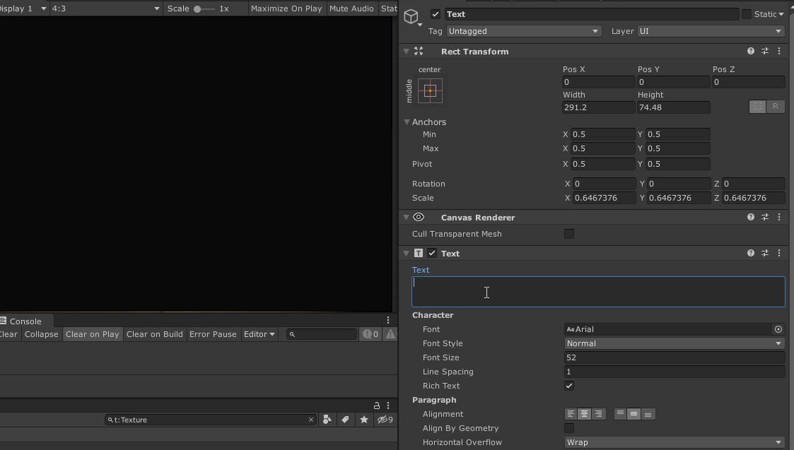

* Text 컴포넌트의 Inspector 창에는 출력할 텍스트를 입력할 수 있는 텍스트 영역이 있으며, 출력될 텍스트의 폰트, 스타일(볼드, 기울임 등), 폰트 사이즈, 텍스트 정렬 등 다양한 서식을 설정할 수도 있습니다.

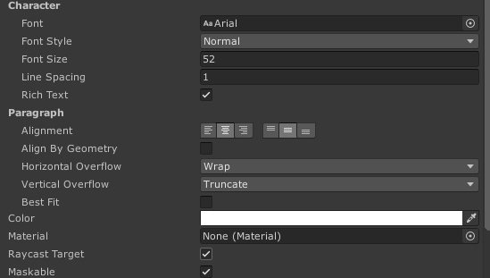

### Image

* Image 컴포넌트에서는 이미지(Texture 또는 Sprite)를 Canvas 상에 출력할 수 있는 시각적 컴포넌트입니다. Image의 'Sprite'항목을 선택하 출력할 이미지의 종류를 변경할 수 있으며, Color 필드에서 이미지의 색상을 설정할 수도 있습니다.

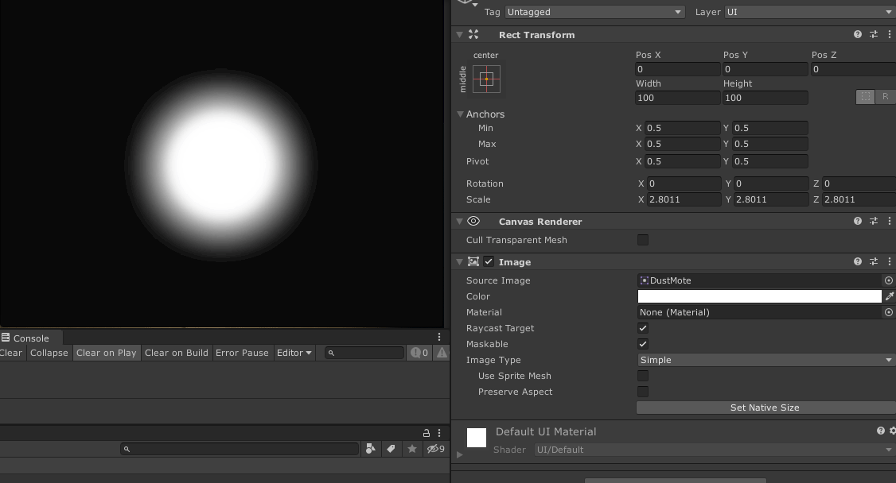

#### 텍스처를 Image 컴포넌트에 적용하기

* 텍스처를 Image 컴포넌트에 사용하기 위해서는 Texture를 Image 컴포넌트에서 사용할 수 있는 타입으로 Import해야 합니다. 특히, 적용하고 싶은 Texture를 프로젝트에 추가했음에도 불구하고 Image 컴포넌트의 Sprite 선택창에서 보이지 않는 경우, 그 Texture의 Import 타입이 올바르게 설정되지 않았을 가능성이 높습니다.

* 이를 해결하기 위해서는 해당 Project 창에서 해당 Texture 에셋을 선택한 뒤에, Inspector창에서 표시되어있는 Import 설정에서 **Texture Type**의 값을 **Sprite (2D / UI)** 로 변경해야 합니다. 하단의 **Apply** 버튼을 눌러 변경사항을 적용하면, 해당 Texture를 UI Image에서 사용가능하게 됩니다.

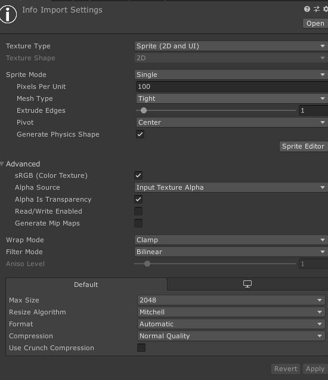

## 상호작용 UI Component

* 마우스 클릭, 키보드 입력과 같이 사용자의 입력을 받으면 상태를 변경하거나 특정 이벤트를 실행하는 방식으로 UI 객체와 상호 작용할 수 있는 기능을 제공하는 특수한 UI Component입니다.

* 일반적으로, 상호 작용 Component는 자체적으로는 시각적으로 표현되지 않기 때문에 단독으로는 사용할 수 없습니다. 따라서, 이전 파트에서 설명드린 Image와 같은 **시각적 UI Component**와 결합하여 사용해야 합니다. 예를 들어, 클릭하여 상호작용 가능한 `Button` 컴포넌트는 위의 `Image` 컴포넌트와 같이 사용할 수 있습니다. 만약 `Image`없이 `Button` 컴포넌트만 사용한다면, 사용자가 어느 영역을 클릭해야 하는지 시각적으로 확인할 수 없기 때문에 `Button`이 제대로 활용할 수 없기 때문입니다.

* 또한, 상호 작용 Component는 지정된 방식으로 상호 작용이 발생했을 때 UnityEvent를 호출할 수 있으며, 우리가 작성한 스크립트를 이 UnityEvent와 연결하여 Custom한 동작을 구현할 수 있습니다. UGUI의 UnityEvent에 대해서는 Scripting 파트에서 좀 더 자세히 살펴보도록 하겠습니다.

### Button

* Button은 특정 Image를 클릭하는 방식으로 동작하는 가장 기본적인 상호작용 컴포넌트 입니다.

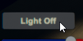

* Button은 클릭되었을 때마다 `OnClick` UnityEvent를 호출합니다. 따라서, 버튼이 클릭되었을 마다 실행되어야 하는 스크립트는 이 이벤트에 연결할 수 있습니다.

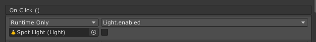

### Toggle

* Toggle은 입력에 따라 On/Off 상태를 나타낼 수 있는 상호작용 컴포넌트로, 다른 UI 프로그램에서는 'Checkbox'라고도 불립니다. Toggle은 마치 전등 스위치처럼 상호작용을 할 때 마다 On에서 Off로, 또는 Off에서 On으로 상태가 반전됩니다.

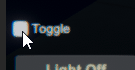

* Toggle은 값이 변경 될 때마다 `OnValueChanged` UnityEvent를 호출합니다. 따라서, Toggle의 상태가 변경될 때마다 수행되어야 하는 스크립트는 이 이벤트에 연결할 수 있습니다.

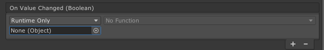

### Slider

*  지정된 범위 내에서만 움직일 수 있는 핸들을 클릭/드래그 하여 최소값과 최대값 사이의 값을 표현할 수 있는 상호작용 컴포넌트 입니다. Inspector 창에서 Slider가 표현하는 최소값과 최대값을 설정할 수 있습니다.

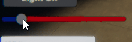

* 예를 들어, 최소값을 `0`, 최대값을 `10`으로 설정한 Slider가 수평으로 배치되어 있다고 가정합시다. 이 Slider의 Handle을 왼쪽 끝으로 가져가면 Slider는 최소값인 `0`을 표현하며, 오른쪽 끝으로 가져갔을 때에는 최대값인 `10`을 표현합니다. Handle을 그 사이 위치에 둔다면 그 정도를 따져 최소값과 최대값의 사이에 있는 값을 표현합니다.

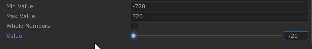

Slider는 값이 변경 될 때마다 `OnValueChanged` UnityEvent를 호출합니다. 따라서, Slider가 나타내는 값이 변경될 때(예: Slider의 핸들을 드래그 했을 때)마다 호출되어야 하는 스크립트는 이 이벤트와 연결할 수 있습니다.

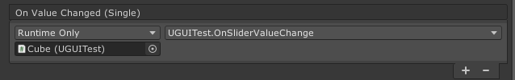

### Dropdown
* Dropdown은 사용자가 선택할 수 있는 옵션들의 목록을 보여주며, 이 옵션목록 중에서 하나의 옵션을 선택할 수 있는 상호작용 컴포넌트입니다.

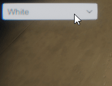

* Inspector에서는 Dropdown에 추가하고 싶은 옵션을 목록에 추가할 수 있으며, 초기 옵션 선택값 등 Dropdown과 관련된 다양한 세팅들을 제공합니다.

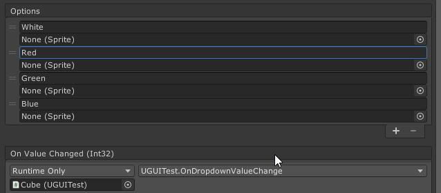

* Drpdown은 현재 선택한 옵션이 변경 될 때마다  `OnValueChanged` UnityEvent를 호출합니다. 따라서, Dropdown 옵션값을 변경할 때마다호출되어야 하는 스크립트를 이 이벤트와 연결할 수 있습니다.

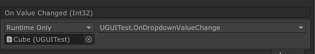
