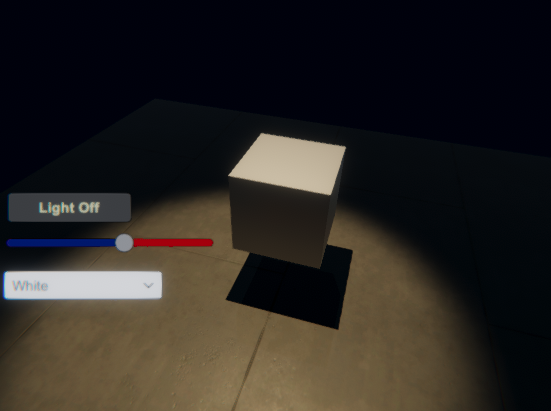

#	UnityEvent
UnityEvent는 유니티 엔진에서 Event를 호출하여 UnityEvent에 등록된 콜백 함수들을 실행할 수 있는 기능입니다.  

## Call-back 함수


## Example: Cube Controller

이번 예제에서는 이전 챕터에서 배운 **상호작용 UI 컴포넌트**의 UnityEvent와 우리가 작성한 스크립트를 연결하는 방법을 학습할 것입니다.


### Button에 이벤트 추가하기


```cs


```

### Slider에 이벤트 추가하기

```cs
/// <summary>
/// Slider의 값에 따라서 Cube의 회전 속도를 변경합니다.
/// </summary>
/// <param name="value">현재 슬라이더의 값</param>
public void OnSliderValueChange(float value)
{
    rotSpeed = value;
}

```

### Dropdown에 이벤트 추가하기
```cs
public class UGUITest : MonoBehaviour
{
    private MeshRenderer meshRenderer;

    private static Color[] ColorPresets = new Color[4]
    {
        Color.white, Color.red,Color.green, Color.blue
    };

    // Start is called before the first frame update
    void Awake()
    {
        meshRenderer = GetComponent<MeshRenderer>();
    }

    /// <summary>
    /// UI 콜백 함수: 선택한 Dropdown 메뉴의 index에 따라서 Cube의 색을 설정합니다.
    /// </summary>
    /// <param name="index"></param>
    public void OnDropdownValueChange(int index)
    {
        meshRenderer.material.color= ColorPresets[index];
    }
}


```
