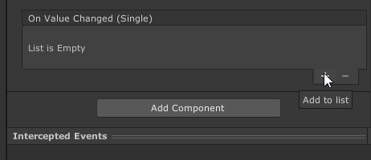
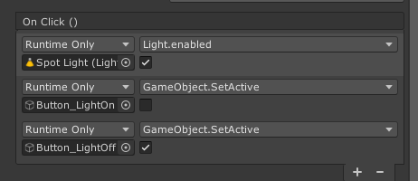

#	UnityEvent

UnityEvent는 유니티 엔진에서 Event를 호출하여 UnityEvent에 등록된 콜백 함수들을 실행할 수 있는 기능입니다.  

## Callback 함수

* 특정 Event가 발생되었을 때 호출되는 함수를 Callback 함수라고 부릅니다. UI Event는 UI 컴포넌트가 UnityEvent를 발생시켜서, 여기에 연결되어 있는 Callback 함수가 실행되도록 만들어줍니다.



* 각 상호작용 UI 컴포넌트의 Inpsector에서 Event Callback 함수를 추가할 수 있습니다.


## Example: Cube Controller


이번 예제에서는 이전 챕터에서 배운 **상호작용 UI 컴포넌트**의 UnityEvent와 우리가 작성한 스크립트를 연결하는 방법을 학습할 것입니다.


### Button에 이벤트 추가하기

* Button 이벤트는 **Button을 클릭할 때 마다** 발생합니다. 아래는 Button에 다양한 이벤트 Callback 함수를 연결하여, Light가 꺼지고 켜지는 동작 등을 수행할 있도록 만든 예시입니다.

 


### Dropdown에 이벤트 추가하기

* Dropdown도 Button과 마찬가지로 이벤트를 추가할 수 있습니다. Dropdown의 이벤트는 **Dropdown 메뉴에서 특정 항목을 선택할 때마다 발생**합니다. Dropdown 선택 이벤트와 함께 **선택한 항목 번호에 해당하는 index 값을** 같이 받아 올 수 있는데, 이를 위해서는 이벤트 Callback 함수에 **int 인수를 하나 추가**해야 합니다. 아래의 예제는 Dropdown의 Index 값에 따라서 Cube의 Color을 변경하는 간단한 기능입니다.

```cs
public class UGUITest : MonoBehaviour
{
    private MeshRenderer meshRenderer;

    private static Color[] ColorPresets = new Color[4]
    {
        Color.white, Color.red,Color.green, Color.blue
    };

    // Start is called before the first frame update
    void Awake()
    {
        meshRenderer = GetComponent<MeshRenderer>();
    }

    /// <summary>
    /// UI 콜백 함수: 선택한 Dropdown 메뉴의 index에 따라서 Cube의 색을 설정합니다.
    /// </summary>
    /// <param name="index"></param>
    public void OnDropdownValueChange(int index)
    {
        meshRenderer.material.color= ColorPresets[index];
    }
}


```
### Slider에 이벤트 추가하기

* Slider의 이벤트 함수는 **Slider 값이 변경될 때마다 호출**됩니다. Dropdown과 마찬가지로 변경 후의 Slider가 나타내는 값을 받아올 수 있지만, **int 대신 float 자료형의 인수를 사용**합니다. 아래의 예제는 Slider 값에 따라서 회전 속도를 변경하는 간단한 기능을 보여줍니다.

```cs
/// <summary>
/// Slider의 값에 따라서 Cube의 회전 속도를 변경합니다.
/// </summary>
/// <param name="value">현재 슬라이더의 값</param>
public void OnSliderValueChange(float value)
{
    rotSpeed = value;
}

```
